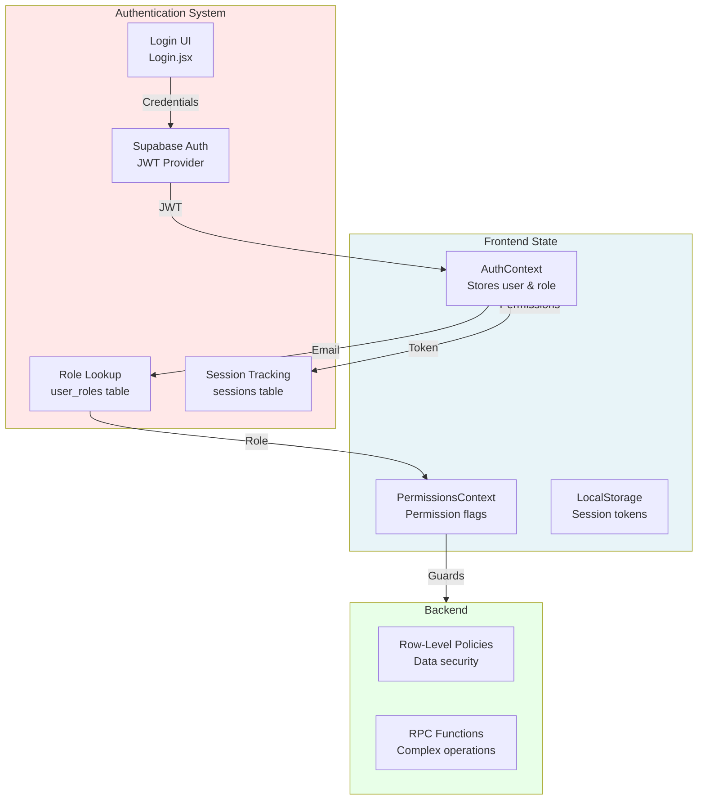
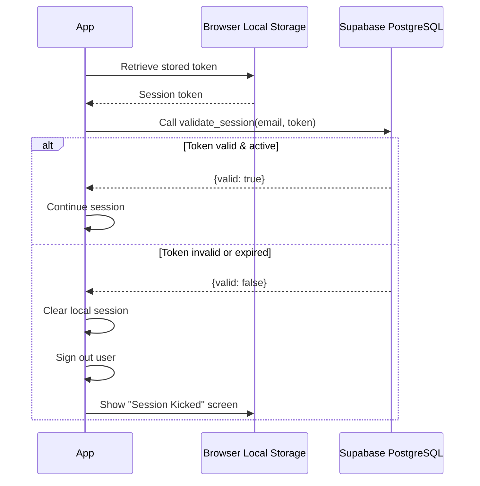
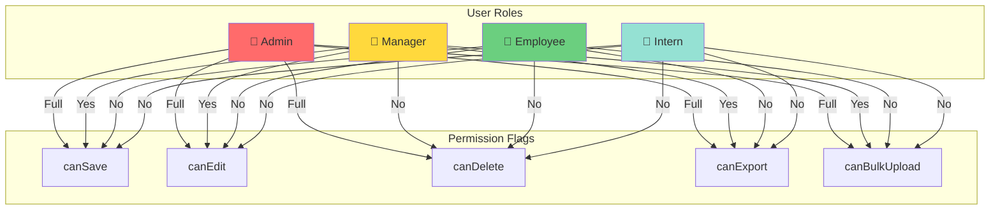
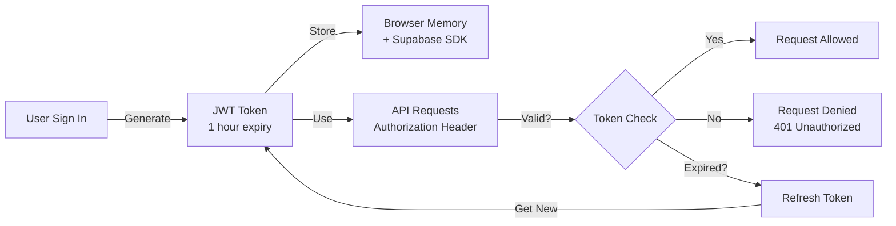

# Verto Authentication & Authorization Flow

## Complete Security Architecture Documentation

---

## Table of Contents

1. [Authentication Overview](#authentication-overview)
2. [Sign-In Flow](#sign-in-flow)
3. [Session Management](#session-management)
4. [Role-Based Access Control](#role-based-access-control)
5. [Multi-Device Detection](#multi-device-detection)
6. [Token Management](#token-management)
7. [Security Policies](#security-policies)
8. [Troubleshooting](#troubleshooting)

---

## Authentication Overview

### Architecture Components



---

## Sign-In Flow

### Step 1: User Credentials Input

**File:** `src/pages/Login.jsx`

**UI Features:**
- Email input with validation
- Password input with visibility toggle
- "Remember me" option
- Error message display
- Loading state during auth

```javascript
const [email, setEmail] = useState("");
const [password, setPassword] = useState("");
const [loading, setLoading] = useState(false);
const [error, setError] = useState("");

const handleSignIn = async (e) => {
  e.preventDefault();
  setLoading(true);
  
  try {
    const { error } = await supabase.auth.signInWithPassword({
      email,
      password
    });
    
    if (error) {
      setError(error.message);
    }
  } catch (err) {
    setError("Unexpected error occurred");
  } finally {
    setLoading(false);
  }
};
```

### Step 2: Supabase Authentication

**Provider:** Supabase Auth API  
**Endpoint:** `https://[PROJECT].supabase.co/auth/v1/token`  
**Method:** JWT-based authentication

**Flow:**
1. Supabase verifies email/password against `auth.users` table
2. On success, returns JWT token
3. Token includes user ID and basic user info
4. Token is short-lived (1 hour default)

**Response:**
```json
{
  "access_token": "eyJhbGciOiJIUzI1NiIsInR5cCI6IkpXVCJ9...",
  "token_type": "bearer",
  "expires_in": 3600,
  "refresh_token": "refresh_token_value",
  "user": {
    "id": "user-uuid",
    "email": "user@company.com",
    "email_confirmed_at": "2026-01-01T00:00:00Z",
    "created_at": "2026-01-01T00:00:00Z"
  }
}
```

### Step 3: AuthContext Initialization

**File:** `src/context/AuthContext.jsx`

```javascript
const AuthProvider = ({ children }) => {
  const [user, setUser] = useState(null);
  const [role, setRole] = useState(null);
  const [loading, setLoading] = useState(true);
  const [showLivePopup, setShowLivePopup] = useState(false);
  const [sessionKicked, setSessionKicked] = useState(false);

  // On mount, check existing session
  useEffect(() => {
    const getSession = async () => {
      const { data } = await supabase.auth.getUser();
      
      if (data?.user) {
        setUser(data.user);
        
        // Fetch user's role
        await fetchRole(data.user.email);
        
        // Validate session is unique
        await validateSession();
        
        // Start periodic validation
        startSessionPolling();
      }
      
      setLoading(false);
    };

    getSession();

    // Listen for auth state changes
    const { data: listener } = supabase.auth.onAuthStateChange(
      (event, session) => {
        if (event === "SIGNED_IN" && session?.user) {
          setUser(session.user);
          fetchRole(session.user.email);
          
          // Initialize popup manager for "We're Live!" popup
          popupManager.initializeSession(session.user.id);
          if (popupManager.shouldShowPopup()) {
            setShowLivePopup(true);
          }
        }

        if (event === "SIGNED_OUT") {
          setUser(null);
          setRole(null);
          popupManager.clearSession();
        }
      }
    );

    return () => {
      listener.subscription.unsubscribe();
    };
  }, []);

  return (
    <AuthContext.Provider
      value={{
        user,
        role,
        loading,
        showLivePopup,
        sessionKicked,
        setShowLivePopup
      }}
    >
      {children}
    </AuthContext.Provider>
  );
};
```

### Step 4: Role Fetching

**Query:** SELECT from `user_roles` table

```sql
SELECT role FROM user_roles WHERE email = $1
```

**Role Values:**
- `admin` - Full access to all features
- `manager` - Can create/edit records, limited delete access
- `employee` - Read-only access
- `intern` - Highly restricted view-only access

### Step 5: "We're Live!" Popup

**File:** `src/utils/popupManager.js`

**Logic:**
- On first sign-in, initialize a session ID
- Check if popup was shown in current session
- Display popup once per browser session
- Clears on tab close or logout

```javascript
export const popupManager = {
  initializeSession: (userId) => {
    const sessionId = `${userId}_${Date.now()}`;
    sessionStorage.setItem('verto_session_id', sessionId);
    return sessionId;
  },

  shouldShowPopup: () => {
    const sessionId = sessionStorage.getItem('verto_session_id');
    const popupShown = sessionStorage.getItem('verto_live_popup_shown');
    return sessionId && !popupShown;
  },

  markPopupShown: () => {
    sessionStorage.setItem('verto_live_popup_shown', 'true');
  },

  clearSession: () => {
    sessionStorage.removeItem('verto_session_id');
    sessionStorage.removeItem('verto_live_popup_shown');
  }
};
```

---

## Session Management

### Session Storage

**Location:** Browser LocalStorage + Supabase `sessions` table

**Stored Data:**
```javascript
{
  verto_user_email: "user@company.com",
  verto_session_token: "unique_session_token_xyz",
  loginDate: "2026-06-15"
}
```

### Session Validation Flow

**Trigger:** Every 3 seconds via polling



### Midnight Logout

**Feature:** Automatic logout at midnight

**Implementation:**
```javascript
useEffect(() => {
  const checkMidnightLogout = async () => {
    const loginDate = localStorage.getItem("loginDate");
    const today = new Date().toDateString();

    // Different day from login
    if (loginDate && loginDate !== today) {
      await supabase.auth.signOut();
      localStorage.removeItem("loginDate");
      window.location.reload();
      return;
    }

    // Calculate time until midnight
    const now = new Date();
    const midnight = new Date(now);
    midnight.setDate(midnight.getDate() + 1);
    midnight.setHours(0, 0, 0, 0);
    
    const timeUntilMidnight = midnight.getTime() - now.getTime();

    // Schedule logout at midnight
    const timeoutId = window.setTimeout(async () => {
      await supabase.auth.signOut();
      window.location.reload();
    }, timeUntilMidnight);

    return () => window.clearTimeout(timeoutId);
  };

  checkMidnightLogout();
}, [user]);
```

---

## Role-Based Access Control

### Permission Matrix



### Permission Implementation

**File:** `src/hooks/usePermissions.js`

```javascript
export function usePermissions() {
  const { role, loading } = useAuth();

  return {
    role,
    loading,
    isAdmin: role === 'admin',
    isManager: role === 'manager',
    isEmployee: role === 'employee',
    isIntern: role === 'intern',
    
    // Feature flags
    canSave: role === 'admin' || role === 'manager',
    canEdit: role === 'admin' || role === 'manager',
    canDelete: role === 'admin',
    canExport: role === 'admin' || role === 'manager',
    canImport: role === 'admin' || role === 'manager',
    canApprove: role === 'admin' || role === 'manager',
    canBulkUpload: role === 'admin' || role === 'manager',
  };
}
```

### Feature Guards

**Example - Restrict Invoice Creation:**

```javascript
const AddInvoiceModal = ({ isOpen, onClose }) => {
  const { canSave, isIntern } = usePermissions();

  if (!canSave) {
    return <div>You don't have permission to create invoices</div>;
  }

  return (
    // Modal form...
  );
};
```

---

## Multi-Device Detection

### Single Session Enforcement

**Goal:** Only one active session per user across all devices

### Implementation Strategy

**Database Table:** `sessions`

```sql
CREATE TABLE sessions (
  id BIGINT PRIMARY KEY GENERATED BY DEFAULT AS IDENTITY,
  user_email VARCHAR(100) NOT NULL,
  session_token VARCHAR(255) UNIQUE NOT NULL,
  device_info TEXT,
  ip_address VARCHAR(45),
  status VARCHAR(20) DEFAULT 'active',
  created_at TIMESTAMP DEFAULT NOW(),
  last_activity TIMESTAMP DEFAULT NOW(),
  expires_at TIMESTAMP,
  
  CONSTRAINT unique_active_session UNIQUE(user_email, status)
);
```

**Logic:**

1. **Sign-In on Device A:**
   - Generate session_token
   - INSERT into sessions table (Device A active)

2. **Sign-In on Device B:**
   - Generate new session_token
   - INSERT into sessions table (Device B active)
   - Constraint violation: UNIQUE(user_email, status)
   - Device A session automatically revoked

3. **Device A Next Action:**
   - Calls `validate_session(email, old_token)`
   - Token is no longer valid
   - Session kicked out screen displayed

### Validation RPC Function

```sql
CREATE OR REPLACE FUNCTION validate_session(
  p_email VARCHAR,
  p_token VARCHAR
) RETURNS TABLE (valid BOOLEAN) AS $$
BEGIN
  RETURN QUERY
  SELECT EXISTS (
    SELECT 1 FROM sessions
    WHERE user_email = p_email
    AND session_token = p_token
    AND status = 'active'
    AND (expires_at IS NULL OR expires_at > NOW())
  );
END;
$$ LANGUAGE plpgsql;
```

### Polling Mechanism

**Frequency:** Every 3 seconds  
**Purpose:** Detect when another device logs in  
**Action on Failure:** Display "Session Kicked" screen

```javascript
const startSessionPolling = useCallback(() => {
  sessionCheckIntervalRef.current = setInterval(() => {
    validateSession();
  }, 3000); // Check every 3 seconds
}, [validateSession]);

const validateSession = useCallback(async () => {
  const email = localStorage.getItem("verto_user_email");
  const token = localStorage.getItem("verto_session_token");

  if (!email || !token) return;

  const { data, error } = await supabase.rpc("validate_session", {
    p_email: email,
    p_token: token,
  });

  if (error || !data?.valid) {
    // Another device has logged in
    clearInterval(sessionCheckIntervalRef.current);
    localStorage.removeItem("verto_session_token");
    localStorage.removeItem("verto_user_email");
    
    setSessionKicked(true);
    await supabase.auth.signOut();
    setUser(null);
    setRole(null);
  }
}, []);
```

---

## Token Management

### JWT Token Lifecycle



### Access Token

- **Duration:** 1 hour
- **Storage:** In-memory + Supabase SDK internal storage
- **Purpose:** Authenticate API requests
- **Header:** `Authorization: Bearer {access_token}`

### Refresh Token

- **Duration:** 7 days (configurable)
- **Storage:** Browser local storage (secure)
- **Purpose:** Obtain new access token without re-login
- **Usage:** Automatic via Supabase SDK

**Manual Refresh:**
```javascript
const { data, error } = await supabase.auth.refreshSession();

if (data.session) {
  // New tokens obtained
  const newAccessToken = data.session.access_token;
}
```

### Token Expiration Handling

**Automatic Handling:**
- Supabase SDK automatically refreshes tokens
- No action needed from developers

**Manual Handling (if needed):**
```javascript
setInterval(async () => {
  const { data } = await supabase.auth.getSession();
  
  if (data.session) {
    const expiresAt = new Date(data.session.expires_at * 1000);
    const now = new Date();
    const timeLeft = expiresAt - now;
    
    if (timeLeft < 60000) { // 1 minute left
      await supabase.auth.refreshSession();
    }
  }
}, 30000); // Check every 30 seconds
```

---

## Security Policies

### Row-Level Security (RLS)

**File:** Supabase dashboard (SQL Editor)

**Example Policy - Users can only see their own data:**

```sql
CREATE POLICY user_can_see_own_data ON user_roles
  FOR SELECT
  USING (email = auth.jwt() ->> 'email');
```

**Example Policy - Admin can see all:**

```sql
CREATE POLICY admin_see_all ON invoices
  FOR SELECT
  USING (
    (SELECT role FROM user_roles 
     WHERE email = auth.jwt() ->> 'email') = 'admin'
  );
```

### Data Protection

| Measure | Implementation |
|---------|-----------------|
| **Encryption in Transit** | HTTPS only |
| **Encryption at Rest** | Supabase database encryption |
| **Password Storage** | bcrypt via Supabase Auth |
| **Token Signing** | RS256 algorithm |
| **CORS** | Restricted origins |

---

## Troubleshooting

### Common Issues & Solutions

#### "Session Kicked" on Every Request

**Cause:** Session validation failing  
**Solution:**
1. Check browser console for errors
2. Verify `validate_session` RPC function exists
3. Check if session token stored correctly
4. Clear browser data and re-login

#### "Invalid Credentials" Error

**Cause:** Wrong email/password or user doesn't exist  
**Solution:**
1. Verify email address is correct
2. Check Supabase user exists
3. Verify password is correct
4. Check user email is verified

#### "Insufficient Permissions" Error

**Cause:** User role doesn't have required permission  
**Solution:**
1. Check user's role in `user_roles` table
2. Verify role has necessary permissions
3. Contact admin to elevate role
4. Check RLS policies aren't blocking

#### Token Expires During Operation

**Cause:** Long-running operation + token expiration  
**Solution:**
1. Implemented automatic token refresh
2. Increase token expiration time (admin setting)
3. Break operation into smaller requests

#### Different Permissions on Different Devices

**Cause:** Stale role data in frontend  
**Solution:**
1. Force refresh: `Ctrl+Shift+R`
2. Check `user_roles` table for correct role
3. Clear browser cache
4. Re-login

---

## Security Best Practices

1. **Never Log Tokens:** Tokens contain sensitive information
2. **Use HTTPS Always:** Prevents token interception
3. **Validate Server-Side:** Don't trust client-side checks alone
4. **Rotate Credentials:** Change passwords regularly
5. **Monitor Audit Logs:** Track suspicious activities
6. **Use Strong Passwords:** Enforce password policies
7. **Implement 2FA:** Two-factor authentication (future)
8. **Session Timeout:** Auto-logout inactive users (midnight logout)

---

## Audit Trail

**File:** `src/utils/Auditlog.js`

All authentication events are logged:

```javascript
{
  action: "LOGIN",
  category: "User Management",
  description: "User john@company.com signed in",
  user_email: "john@company.com",
  user_role: "admin",
  ip_address: "192.168.1.1",
  created_at: "2026-06-15T10:30:00Z"
}
```

---

*For related documentation, see DEPLOYMENT_GUIDE.md and DATABASE_SCHEMA.md*
