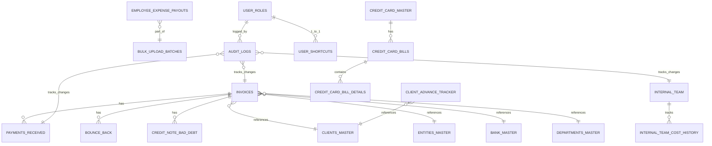

# Verto Database Schema Documentation

## Complete PostgreSQL Schema Reference

---

## Database Overview

**Database Type:** PostgreSQL 14+  
**Provider:** Supabase  
**Schema:** `public`  
**Total Tables:** 25+  
**Materialized Views:** 3+  
**RPC Functions:** 5+

---

## Core Financial Tables

### 1. **invoices**

**Purpose:** Store all invoice records

**Columns:**

```sql
CREATE TABLE invoices (
  id BIGINT PRIMARY KEY GENERATED BY DEFAULT AS IDENTITY,
  
  -- Basic Details
  invoice_number VARCHAR(50) UNIQUE NOT NULL,
  entity_id BIGINT REFERENCES entities_master(id),
  entity_name VARCHAR(100),
  client_id BIGINT REFERENCES clients_master(id),
  client_name VARCHAR(100) NOT NULL,
  ledger_name VARCHAR(100),
  
  -- Financial Details
  invoice_value NUMERIC(15,2) NOT NULL,    -- Base amount
  tds_percent NUMERIC(5,2),                -- TDS percentage
  tds_amount NUMERIC(15,2),                -- Calculated TDS
  verto_fee NUMERIC(15,2),                 -- Service fee
  gst_percent NUMERIC(5,2) DEFAULT 18,    -- GST percentage
  gst_amount NUMERIC(15,2),                -- Calculated GST
  gross_receivable NUMERIC(15,2),          -- Gross amount
  net_receivable NUMERIC(15,2),            -- Net receivable
  
  -- Dates
  invoice_date DATE NOT NULL,
  impact_month VARCHAR(7),                 -- YYYY-MM format
  expected_collection_date DATE,
  
  -- Department & Category
  dept_code VARCHAR(10) REFERENCES departments_master(dept_code),
  dept_name VARCHAR(100),
  pay_head VARCHAR(50),
  
  -- Banking
  bank_id BIGINT REFERENCES bank_master(id),
  bank_name VARCHAR(100),
  
  -- Status & Tracking
  status VARCHAR(20) DEFAULT 'active',     -- active, closed
  invoice_description TEXT,
  
  -- Audit
  created_at TIMESTAMP DEFAULT NOW(),
  updated_at TIMESTAMP DEFAULT NOW(),
  created_by VARCHAR(100),
  CONSTRAINT positive_amount CHECK (invoice_value > 0)
);

CREATE INDEX idx_invoices_client ON invoices(client_name);
CREATE INDEX idx_invoices_entity ON invoices(entity_name);
CREATE INDEX idx_invoices_date ON invoices(invoice_date);
CREATE INDEX idx_invoices_impact_month ON invoices(impact_month);
```

**Key Relationships:**
- References: `entities_master`, `clients_master`, `bank_master`, `departments_master`
- Referenced By: `payments_received`, `bounce_back`, `credit_note_bad_debt`

**Outstanding Amount Calculation:**
```
outstanding = invoice.net_receivable - SUM(payments_received.amount_received)
```

---

### 2. **payments_received**

**Purpose:** Track payments received against invoices

**Columns:**

```sql
CREATE TABLE payments_received (
  id BIGINT PRIMARY KEY GENERATED BY DEFAULT AS IDENTITY,
  
  -- Reference
  invoice_id BIGINT REFERENCES invoices(id) ON DELETE CASCADE,
  payment_ref VARCHAR(50) UNIQUE,
  
  -- Payment Details
  amount_received NUMERIC(15,2) NOT NULL,
  payment_date DATE NOT NULL,
  bank_id BIGINT REFERENCES bank_master(id),
  
  -- Audit
  remarks TEXT,
  created_at TIMESTAMP DEFAULT NOW(),
  created_by VARCHAR(100),
  
  CONSTRAINT positive_amount CHECK (amount_received > 0)
);

CREATE INDEX idx_payments_invoice ON payments_received(invoice_id);
CREATE INDEX idx_payments_date ON payments_received(payment_date);
```

**Key Features:**
- Auto-generates `payment_ref` using pattern: `PR-{DDMMYY}-{Seq}`
- Cascade deletion (removes on invoice delete)
- Validation: Payment amount ≤ Outstanding amount

---

### 3. **advance_payments**

**Purpose:** Track advance payments not linked to specific invoices

**Columns:**

```sql
CREATE TABLE advance_payments (
  id BIGINT PRIMARY KEY GENERATED BY DEFAULT AS IDENTITY,
  
  -- Reference
  payment_ref VARCHAR(50) UNIQUE,
  
  -- Client Details
  client_name VARCHAR(100) NOT NULL,
  ledger_name VARCHAR(100),
  entity_name VARCHAR(100),
  department_name VARCHAR(100),
  
  -- Payment Details
  amount NUMERIC(15,2) NOT NULL,
  payment_date DATE NOT NULL,
  bank_id BIGINT REFERENCES bank_master(id),
  
  -- Status
  status VARCHAR(20) DEFAULT 'pending',    -- pending, applied, closed
  
  -- Audit
  remarks TEXT,
  created_at TIMESTAMP DEFAULT NOW(),
  created_by VARCHAR(100),
  
  CONSTRAINT positive_amount CHECK (amount > 0)
);

CREATE INDEX idx_advances_client ON advance_payments(client_name);
CREATE INDEX idx_advances_date ON advance_payments(payment_date);
```

---

### 4. **payment_made_manual**

**Purpose:** Track manual payment entries (OS payouts, expenses, etc.)

**Columns:**

```sql
CREATE TABLE payment_made_manual (
  id BIGINT PRIMARY KEY GENERATED BY DEFAULT AS IDENTITY,
  
  -- Reference
  entity_id BIGINT REFERENCES entities_master(id),
  entity VARCHAR(100),
  
  -- Payment Details
  client_name VARCHAR(100),
  department VARCHAR(50),
  pay_head VARCHAR(100),
  due_amount NUMERIC(15,2),
  income_tax_deducted NUMERIC(15,2) DEFAULT 0,
  transfer_amount NUMERIC(15,2),          -- Net amount transferred
  
  -- Banking
  bank_id BIGINT REFERENCES bank_master(id),
  bank_name VARCHAR(100),
  payment_date DATE,
  
  -- Tracking
  is_billable BOOLEAN DEFAULT FALSE,      -- Maps to invoice
  petty_cash BOOLEAN DEFAULT FALSE,       -- Petty cash entry
  invoice_id BIGINT REFERENCES invoices(id) ON DELETE SET NULL,
  
  -- Audit
  created_at TIMESTAMP DEFAULT NOW(),
  updated_at TIMESTAMP DEFAULT NOW(),
  created_by VARCHAR(100)
);

CREATE INDEX idx_payment_made_entity ON payment_made_manual(entity);
CREATE INDEX idx_payment_made_client ON payment_made_manual(client_name);
CREATE INDEX idx_payment_made_date ON payment_made_manual(payment_date);
```

---

### 5. **bounce_back**

**Purpose:** Track bounced payments (cheque returns)

**Columns:**

```sql
CREATE TABLE bounce_back (
  id BIGINT PRIMARY KEY GENERATED BY DEFAULT AS IDENTITY,
  
  -- Reference
  invoice_id BIGINT REFERENCES invoices(id) ON DELETE CASCADE,
  invoice_number VARCHAR(50),
  
  -- Bounce Details
  bounce_amount NUMERIC(15,2) NOT NULL,
  bounce_date DATE NOT NULL,
  bounce_reason VARCHAR(255),
  
  -- Re-entry
  re_entry_date DATE,
  re_entry_amount NUMERIC(15,2),
  
  -- Audit
  remarks TEXT,
  created_at TIMESTAMP DEFAULT NOW(),
  created_by VARCHAR(100)
);

CREATE INDEX idx_bounce_invoice ON bounce_back(invoice_id);
CREATE INDEX idx_bounce_date ON bounce_back(bounce_date);
```

---

### 6. **credit_note_bad_debt**

**Purpose:** Track credit notes and bad debt write-offs

**Columns:**

```sql
CREATE TABLE credit_note_bad_debt (
  id BIGINT PRIMARY KEY GENERATED BY DEFAULT AS IDENTITY,
  
  -- Reference
  invoice_id BIGINT REFERENCES invoices(id) ON DELETE CASCADE,
  invoice_number VARCHAR(50),
  
  -- Details
  cn_amount NUMERIC(15,2) NOT NULL,
  cn_date DATE NOT NULL,
  cn_type VARCHAR(20),                    -- credit_note, bad_debt
  reason TEXT,
  
  -- Audit
  created_at TIMESTAMP DEFAULT NOW(),
  created_by VARCHAR(100)
);

CREATE INDEX idx_cn_invoice ON credit_note_bad_debt(invoice_id);
CREATE INDEX idx_cn_date ON credit_note_bad_debt(cn_date);
```

---

## Employee & Payroll Tables

### 7. **internal_team**

**Purpose:** Employee master data

**Columns:**

```sql
CREATE TABLE internal_team (
  id BIGINT PRIMARY KEY GENERATED BY DEFAULT AS IDENTITY,
  
  -- Employee Identifiers
  emp_code VARCHAR(20) UNIQUE NOT NULL,
  name VARCHAR(100) NOT NULL,
  father_name VARCHAR(100),
  email VARCHAR(100) UNIQUE,
  
  -- Employment Details
  designation VARCHAR(100),
  department VARCHAR(50),
  entity VARCHAR(100),
  location VARCHAR(100),
  role VARCHAR(20) DEFAULT 'employee',    -- admin, manager, employee, intern
  status VARCHAR(20) DEFAULT 'Active',    -- Active, Inactive
  
  -- Compensation
  ctc NUMERIC(15,2),                      -- Cost to Company
  pf NUMERIC(15,2),                       -- Provident Fund
  esi NUMERIC(15,2),                      -- Employee State Insurance
  bonus NUMERIC(15,2),
  variable NUMERIC(15,2),
  other_component NUMERIC(15,2),
  reimbursement NUMERIC(15,2),
  gross_value NUMERIC(15,2),              -- Total compensation
  
  -- Dates
  dob DATE,
  doj DATE,
  
  -- Cost Allocation (JSONB)
  cost_head_breakup JSONB DEFAULT '{"ops":0,"temp":0,"rec":0,"projects":0}',
  
  -- Client Focus (JSONB Array)
  client_focus JSONB,                     -- [{clientName, percentage}, ...]
  
  -- Audit
  created_at TIMESTAMP DEFAULT NOW(),
  updated_at TIMESTAMP DEFAULT NOW(),
  
  CONSTRAINT valid_percentages CHECK (
    (cost_head_breakup->>'ops')::numeric >= 0 AND
    (cost_head_breakup->>'ops')::numeric <= 100
  )
);

CREATE INDEX idx_employees_emp_code ON internal_team(emp_code);
CREATE INDEX idx_employees_email ON internal_team(email);
CREATE INDEX idx_employees_dept ON internal_team(department);
```

**JSONB Structures:**
```json
// cost_head_breakup
{
  "ops": 60,
  "temp": 20,
  "rec": 10,
  "projects": 10
}

// client_focus
[
  {"clientName": "ABC Corp", "percentage": 50},
  {"clientName": "XYZ Ltd", "percentage": 50}
]
```

---

### 8. **employee_expense_payouts**

**Purpose:** Track individual and bulk employee expense entries

**Columns:**

```sql
CREATE TABLE employee_expense_payouts (
  id BIGINT PRIMARY KEY GENERATED BY DEFAULT AS IDENTITY,
  
  -- Employee Reference
  emp_code VARCHAR(20),
  employee_name VARCHAR(100),
  
  -- Payout Details
  designation VARCHAR(100),
  entity VARCHAR(100),
  department VARCHAR(100),
  payment_description VARCHAR(255),
  payment_amount NUMERIC(15,2) NOT NULL,
  income_tax_deducted NUMERIC(15,2) DEFAULT 0,
  net_payment NUMERIC(15,2),
  
  -- Dates
  month_of_pay VARCHAR(7),                -- YYYY-MM format
  date_of_pay DATE,
  
  -- Bulk Upload Tracking
  entry_type VARCHAR(20),                 -- single, bulk
  bulk_batch_id BIGINT REFERENCES bulk_upload_batches(id),
  bulk_batch_code VARCHAR(50),
  bulk_file_name VARCHAR(255),
  
  -- Banking
  bank_name VARCHAR(100),
  
  -- Audit
  remarks TEXT,
  created_at TIMESTAMP DEFAULT NOW(),
  created_by VARCHAR(100),
  
  CONSTRAINT positive_payment CHECK (payment_amount > 0)
);

CREATE INDEX idx_payouts_emp ON employee_expense_payouts(emp_code);
CREATE INDEX idx_payouts_month ON employee_expense_payouts(month_of_pay);
CREATE INDEX idx_payouts_batch ON employee_expense_payouts(bulk_batch_id);
```

---

### 9. **bulk_upload_batches**

**Purpose:** Metadata for bulk uploads

**Columns:**

```sql
CREATE TABLE bulk_upload_batches (
  id BIGINT PRIMARY KEY GENERATED BY DEFAULT AS IDENTITY,
  
  batch_code VARCHAR(50) UNIQUE,
  file_name VARCHAR(255),
  upload_date TIMESTAMP DEFAULT NOW(),
  
  total_records INT DEFAULT 0,
  success_count INT DEFAULT 0,
  error_count INT DEFAULT 0,
  
  uploaded_by VARCHAR(100),
  
  CONSTRAINT valid_counts CHECK (success_count + error_count <= total_records)
);

CREATE INDEX idx_batches_code ON bulk_upload_batches(batch_code);
CREATE INDEX idx_batches_date ON bulk_upload_batches(upload_date);
```

---

### 10. **internal_team_cost_history**

**Purpose:** Historical tracking of employee costs

**Columns:**

```sql
CREATE TABLE internal_team_cost_history (
  id BIGINT PRIMARY KEY GENERATED BY DEFAULT AS IDENTITY,
  
  employee_id BIGINT REFERENCES internal_team(id) ON DELETE CASCADE,
  
  effective_year INT,
  effective_month INT,
  
  ctc NUMERIC(15,2),
  pf NUMERIC(15,2),
  esi NUMERIC(15,2),
  total_employee_cost NUMERIC(15,2),
  
  created_at TIMESTAMP DEFAULT NOW()
);

CREATE INDEX idx_cost_history_emp ON internal_team_cost_history(employee_id);
CREATE INDEX idx_cost_history_ym ON internal_team_cost_history(effective_year, effective_month);
```

---

## Master Data Tables

### 11. **bank_master**

**Purpose:** Bank information master

**Columns:**

```sql
CREATE TABLE bank_master (
  id BIGINT PRIMARY KEY GENERATED BY DEFAULT AS IDENTITY,
  
  bank_name VARCHAR(100) UNIQUE NOT NULL,
  bank_code VARCHAR(10),
  account_number VARCHAR(20),
  account_holder VARCHAR(100),
  
  ifsc_code VARCHAR(11),
  branch_name VARCHAR(100),
  
  -- Status
  status VARCHAR(20) DEFAULT 'active',
  
  -- Audit
  created_at TIMESTAMP DEFAULT NOW(),
  
  UNIQUE(ifsc_code, account_number)
);

CREATE INDEX idx_bank_name ON bank_master(bank_name);
```

---

### 12. **clients_master**

**Purpose:** Client information master

**Columns:**

```sql
CREATE TABLE clients_master (
  id BIGINT PRIMARY KEY GENERATED BY DEFAULT AS IDENTITY,
  
  client_name VARCHAR(100) UNIQUE NOT NULL,
  ledger_name VARCHAR(100),
  
  -- Contact
  email VARCHAR(100),
  phone VARCHAR(15),
  
  -- Address
  address TEXT,
  city VARCHAR(100),
  
  -- Status
  status VARCHAR(20) DEFAULT 'active',
  
  -- Audit
  created_at TIMESTAMP DEFAULT NOW(),
  updated_at TIMESTAMP DEFAULT NOW(),
  
  CONSTRAINT unique_ledger_per_client UNIQUE(client_name, ledger_name)
);

CREATE INDEX idx_clients_name ON clients_master(client_name);
```

---

### 13. **entities_master**

**Purpose:** Legal entity information

**Columns:**

```sql
CREATE TABLE entities_master (
  id BIGINT PRIMARY KEY GENERATED BY DEFAULT AS IDENTITY,
  
  entity_name VARCHAR(100) UNIQUE NOT NULL,
  entity_code VARCHAR(20) UNIQUE,
  
  -- Contact
  email VARCHAR(100),
  phone VARCHAR(15),
  
  -- Tax Information
  gst_number VARCHAR(15) UNIQUE,
  pan_number VARCHAR(10) UNIQUE,
  cin_number VARCHAR(21) UNIQUE,
  
  -- Status
  status VARCHAR(20) DEFAULT 'active',
  
  -- Audit
  created_at TIMESTAMP DEFAULT NOW()
);

CREATE INDEX idx_entities_name ON entities_master(entity_name);
```

---

### 14. **departments_master**

**Purpose:** Department/Cost center master

**Columns:**

```sql
CREATE TABLE departments_master (
  id BIGINT PRIMARY KEY GENERATED BY DEFAULT AS IDENTITY,
  
  dept_code VARCHAR(10) UNIQUE NOT NULL,
  dept_name VARCHAR(100) UNIQUE NOT NULL,
  
  description TEXT,
  
  status VARCHAR(20) DEFAULT 'active',
  
  created_at TIMESTAMP DEFAULT NOW()
);

CREATE INDEX idx_dept_code ON departments_master(dept_code);
```

---

## Advance & Credit Card Tables

### 15. **client_advance_tracker**

**Purpose:** Track advances given to clients

**Columns:**

```sql
CREATE TABLE client_advance_tracker (
  id BIGINT PRIMARY KEY GENERATED BY DEFAULT AS IDENTITY,
  
  client_name VARCHAR(100) NOT NULL,
  ledger_name VARCHAR(100),
  
  -- Advance Details
  date DATE NOT NULL,
  amount NUMERIC(15,2) NOT NULL,
  interest NUMERIC(15,2) DEFAULT 0,
  paid_back NUMERIC(15,2) DEFAULT 0,
  pending_due NUMERIC(15,2),              -- Auto-calculated
  
  -- Status
  status VARCHAR(20) DEFAULT 'Pending',   -- Pending, Partially Paid, Closed
  
  -- Audit
  remarks TEXT,
  created_at TIMESTAMP DEFAULT NOW(),
  updated_at TIMESTAMP DEFAULT NOW(),
  
  CONSTRAINT positive_amount CHECK (amount > 0)
);

CREATE INDEX idx_advance_client ON client_advance_tracker(client_name);
CREATE INDEX idx_advance_date ON client_advance_tracker(date);
```

**Pending Due Calculation:**
```
pending_due = amount + interest - paid_back
```

---

### 16. **credit_card_master**

**Purpose:** Credit card information

**Columns:**

```sql
CREATE TABLE credit_card_master (
  id BIGINT PRIMARY KEY GENERATED BY DEFAULT AS IDENTITY,
  
  bank VARCHAR(100) NOT NULL,
  card_last4 VARCHAR(4) NOT NULL,
  issued_to VARCHAR(100),
  
  billing_cycle_from VARCHAR(2),          -- Day of month
  billing_cycle_to VARCHAR(2),
  payment_date VARCHAR(2),
  
  status VARCHAR(20) DEFAULT 'active',
  
  created_at TIMESTAMP DEFAULT NOW(),
  
  CONSTRAINT unique_card UNIQUE(bank, card_last4, issued_to)
);

CREATE INDEX idx_card_bank ON credit_card_master(bank);
```

---

### 17. **credit_card_bills**

**Purpose:** Credit card billing statements

**Columns:**

```sql
CREATE TABLE credit_card_bills (
  id BIGINT PRIMARY KEY GENERATED BY DEFAULT AS IDENTITY,
  
  card_master_id BIGINT REFERENCES credit_card_master(id) ON DELETE CASCADE,
  
  amount NUMERIC(15,2) NOT NULL,          -- Bill amount
  penalty NUMERIC(15,2) DEFAULT 0,
  cash_back NUMERIC(15,2) DEFAULT 0,
  amount_payable NUMERIC(15,2),           -- Auto-calculated
  amount_paid NUMERIC(15,2) DEFAULT 0,
  
  status VARCHAR(20) DEFAULT 'pending',   -- pending, paid
  
  created_at TIMESTAMP DEFAULT NOW(),
  updated_at TIMESTAMP DEFAULT NOW()
);

CREATE INDEX idx_bills_card ON credit_card_bills(card_master_id);
```

**Amount Payable Calculation:**
```
amount_payable = amount + penalty - cash_back
```

---

### 18. **credit_card_bill_details**

**Purpose:** Line items in credit card bills

**Columns:**

```sql
CREATE TABLE credit_card_bill_details (
  id BIGINT PRIMARY KEY GENERATED BY DEFAULT AS IDENTITY,
  
  bill_id BIGINT REFERENCES credit_card_bills(id) ON DELETE CASCADE,
  
  date_of_expense DATE NOT NULL,
  amount NUMERIC(15,2) NOT NULL,
  pay_header VARCHAR(100),                -- Travel, Fuel, etc.
  details TEXT,
  cost_head_breakup VARCHAR(100),         -- Direct, Indirect, etc.
  bill_supporting_received VARCHAR(10),   -- Yes/No
  
  created_at TIMESTAMP DEFAULT NOW()
);

CREATE INDEX idx_details_bill ON credit_card_bill_details(bill_id);
```

---

## Authentication & Security Tables

### 19. **user_roles**

**Purpose:** User role assignment

**Columns:**

```sql
CREATE TABLE user_roles (
  id BIGINT PRIMARY KEY GENERATED BY DEFAULT AS IDENTITY,
  
  email VARCHAR(100) UNIQUE NOT NULL,
  role VARCHAR(20) NOT NULL,              -- admin, manager, employee, intern
  
  created_at TIMESTAMP DEFAULT NOW(),
  updated_at TIMESTAMP DEFAULT NOW()
);

CREATE INDEX idx_user_email ON user_roles(email);
CREATE INDEX idx_user_role ON user_roles(role);
```

---

### 20. **user_shortcuts**

**Purpose:** Per-user keyboard shortcut customization

**Columns:**

```sql
CREATE TABLE user_shortcuts (
  id BIGINT PRIMARY KEY GENERATED BY DEFAULT AS IDENTITY,
  
  email VARCHAR(100) UNIQUE NOT NULL,
  
  -- Shortcuts as JSONB
  shortcuts JSONB DEFAULT '{}',           -- {shortcutId: "ctrl+key", ...}
  
  updated_at TIMESTAMP DEFAULT NOW()
);

CREATE INDEX idx_shortcuts_email ON user_shortcuts(email);
```

**Sample Data:**
```json
{
  "addInvoice": "ctrl+i",
  "paymentReceived": "ctrl+p",
  "commandPalette": "ctrl+k",
  // ... more
}
```

---

### 21. **audit_logs**

**Purpose:** Complete audit trail of all changes

**Columns:**

```sql
CREATE TABLE audit_logs (
  id BIGINT PRIMARY KEY GENERATED BY DEFAULT AS IDENTITY,
  
  -- Action Details
  action VARCHAR(20) NOT NULL,            -- INSERT, UPDATE, DELETE, LOGIN, EXPORT
  category VARCHAR(50) NOT NULL,          -- Invoice, Payment, Employee, etc.
  description TEXT,
  
  -- Entity Reference
  entity_id BIGINT,
  entity_type VARCHAR(50),
  
  -- Changes
  old_values JSONB,                       -- Previous state
  new_values JSONB,                       -- New state
  
  -- User
  user_email VARCHAR(100),
  user_role VARCHAR(20),
  
  -- Metadata
  ip_address VARCHAR(45),
  user_agent TEXT,
  meta JSONB,                             -- Extra context
  
  -- Timestamp
  created_at TIMESTAMP DEFAULT NOW()
);

CREATE INDEX idx_audit_action ON audit_logs(action);
CREATE INDEX idx_audit_category ON audit_logs(category);
CREATE INDEX idx_audit_user ON audit_logs(user_email);
CREATE INDEX idx_audit_date ON audit_logs(created_at DESC);
CREATE INDEX idx_audit_entity ON audit_logs(entity_id, entity_type);
```

---

### 22. **sessions**

**Purpose:** Active user sessions for multi-device detection

**Columns:**

```sql
CREATE TABLE sessions (
  id BIGINT PRIMARY KEY GENERATED BY DEFAULT AS IDENTITY,
  
  user_email VARCHAR(100) NOT NULL,
  session_token VARCHAR(255) UNIQUE NOT NULL,
  
  device_info TEXT,                       -- Device/browser info
  ip_address VARCHAR(45),
  
  status VARCHAR(20) DEFAULT 'active',    -- active, revoked
  
  created_at TIMESTAMP DEFAULT NOW(),
  last_activity TIMESTAMP DEFAULT NOW(),
  expires_at TIMESTAMP,
  
  CONSTRAINT unique_active_session UNIQUE(user_email, status)
);

CREATE INDEX idx_sessions_email ON sessions(user_email);
CREATE INDEX idx_sessions_token ON sessions(session_token);
```

---

## Materialized Views

### View 1: **outstanding_invoice_view**

**Purpose:** Real-time outstanding invoice tracking

```sql
CREATE MATERIALIZED VIEW outstanding_invoice_view AS
SELECT 
  i.id,
  i.invoice_number,
  i.entity_name,
  i.client_name,
  i.ledger_name,
  i.invoice_date,
  i.net_receivable,
  COALESCE(SUM(pr.amount_received), 0) as total_collected,
  i.net_receivable - COALESCE(SUM(pr.amount_received), 0) as outstanding,
  i.expected_collection_date,
  i.bank_id,
  i.bank_name,
  i.dept_name,
  i.status
FROM invoices i
LEFT JOIN payments_received pr ON i.id = pr.invoice_id
GROUP BY i.id
ORDER BY i.invoice_date DESC;

CREATE INDEX idx_outstanding_client ON outstanding_invoice_view(client_name);
CREATE INDEX idx_outstanding_status ON outstanding_invoice_view(status);
```

**Refresh:** On-demand or scheduled

---

### View 2: **payment_received_full_view**

**Purpose:** Complete payment received summary

```sql
CREATE MATERIALIZED VIEW payment_received_full_view AS
SELECT 
  pr.id,
  pr.payment_ref,
  pr.invoice_id,
  i.invoice_number,
  i.client_name,
  i.entity_name,
  i.net_receivable,
  pr.amount_received,
  pr.payment_date,
  b.bank_name,
  pr.remarks,
  pr.created_at
FROM payments_received pr
LEFT JOIN invoices i ON pr.invoice_id = i.id
LEFT JOIN bank_master b ON pr.bank_id = b.id
ORDER BY pr.payment_date DESC;

CREATE INDEX idx_payment_received_date ON payment_received_full_view(payment_date);
```

---

### View 3: **payment_made_view**

**Purpose:** Summary of all payments made

```sql
CREATE MATERIALIZED VIEW payment_made_view AS
SELECT 
  pm.id,
  pm.entity,
  pm.client_name,
  pm.department,
  pm.pay_head,
  pm.due_amount,
  pm.income_tax_deducted,
  pm.transfer_amount,
  pm.bank_name,
  pm.payment_date,
  pm.is_billable,
  pm.petty_cash,
  pm.created_at
FROM payment_made_manual pm
ORDER BY pm.payment_date DESC;

CREATE INDEX idx_payment_made_view_entity ON payment_made_view(entity);
```

---

## RPC Functions

### Function 1: **validate_session**

**Purpose:** Multi-device session validation

```sql
CREATE OR REPLACE FUNCTION validate_session(
  p_email VARCHAR,
  p_token VARCHAR
) RETURNS TABLE (valid BOOLEAN) AS $$
BEGIN
  RETURN QUERY
  SELECT EXISTS (
    SELECT 1 FROM sessions
    WHERE user_email = p_email
    AND session_token = p_token
    AND status = 'active'
    AND (expires_at IS NULL OR expires_at > NOW())
  );
END;
$$ LANGUAGE plpgsql;
```

---

### Function 2: **delete_employee_expense_complete**

**Purpose:** Delete employee payout with cascading cleanup

```sql
CREATE OR REPLACE FUNCTION delete_employee_expense_complete(
  p_payout_id BIGINT
) RETURNS TABLE (success BOOLEAN, message VARCHAR) AS $$
DECLARE
  v_payout_id BIGINT;
BEGIN
  -- Check if record exists
  SELECT id INTO v_payout_id
  FROM employee_expense_payouts
  WHERE id = p_payout_id;
  
  IF v_payout_id IS NULL THEN
    RETURN QUERY SELECT false, 'Record not found'::VARCHAR;
    RETURN;
  END IF;
  
  -- Delete the payout
  DELETE FROM employee_expense_payouts WHERE id = p_payout_id;
  
  -- Delete associated payment_made entries
  DELETE FROM payment_made_manual
  WHERE entity IN (
    SELECT DISTINCT entity FROM employee_expense_payouts WHERE id = p_payout_id
  );
  
  RETURN QUERY SELECT true, 'Deleted successfully'::VARCHAR;
END;
$$ LANGUAGE plpgsql;
```

---

## Row-Level Security (RLS)

### Policy: Read Own User Data

```sql
ALTER TABLE user_roles ENABLE ROW LEVEL SECURITY;

CREATE POLICY read_own_role ON user_roles
  FOR SELECT
  USING (email = current_user_email());
```

### Policy: Admin Can Read All

```sql
CREATE POLICY admin_read_all ON invoices
  FOR SELECT
  USING (current_user_role() = 'admin');
```

---

## Database Relationships Diagram



---

## Indexes Summary

**Total Indexes:** 40+

**Performance Indexes:**
- Date range queries: `created_at`, `payment_date`, `invoice_date`
- Lookup queries: `client_name`, `entity_name`, `emp_code`, `email`
- FK queries: All foreign key columns
- Composite indexes: Year-Month combinations

---

## Backup & Disaster Recovery

**Backup Frequency:** Daily  
**Retention:** 30 days  
**PITR:** Point-in-time recovery available  
**Provider:** Supabase automated backups

---

*For API specifications accessing these tables, see API_DOCUMENTATION.md*  
*For frontend component interactions, see FRONTEND_DOCUMENTATION.md*
