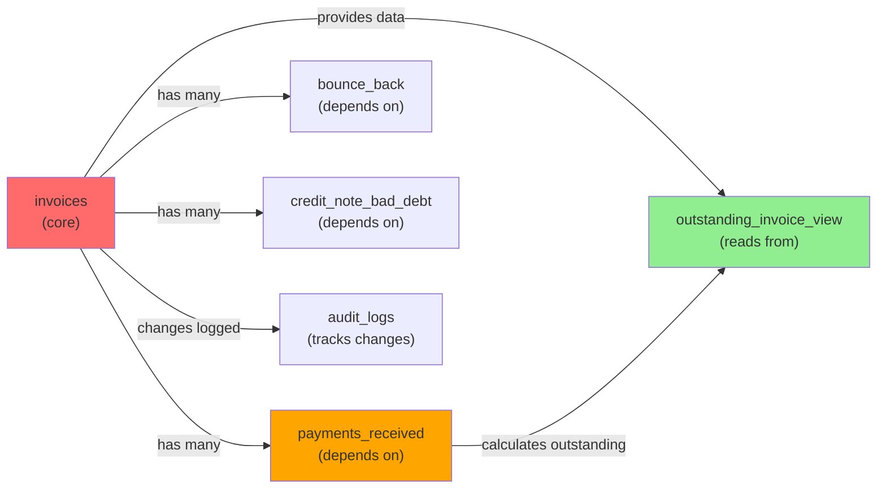
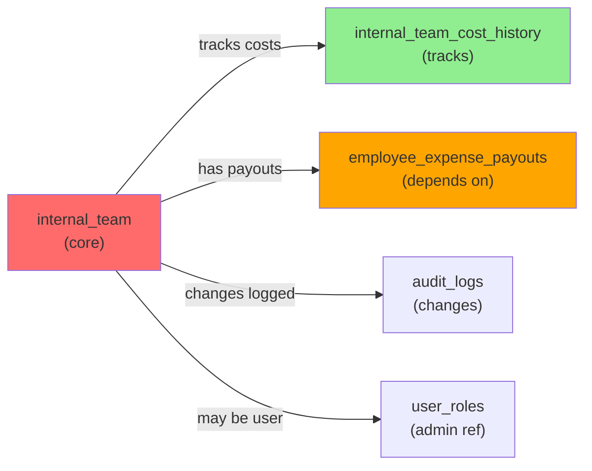
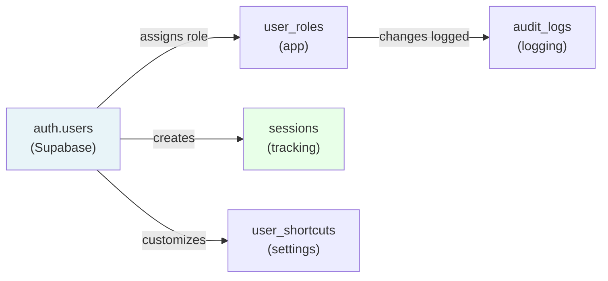

# Verto File Dependency Graph

## Complete Component & Module Dependency Reference

---

## Table of Contents

1. [Import/Export Relationships](#importexport-relationships)
2. [Component Dependencies](#component-dependencies)
3. [Context & Hook Dependencies](#context--hook-dependencies)
4. [Utility Dependencies](#utility-dependencies)
5. [Database Table Dependencies](#database-table-dependencies)
6. [Circular Dependency Analysis](#circular-dependency-analysis)
7. [Dependency Tree Visualization](#dependency-tree-visualization)

---

## Import/Export Relationships

### Core Application Entry Point

**File:** `src/main.jsx`

```javascript
// Imports
import React from 'react'
import ReactDOM from 'react-dom/client'
import App from './App.jsx'
import './index.css'

// Exports: None (entry point)

// Usage: Browser loads this file
```

**Loads:**
- `src/App.jsx` (main application)
- `index.css` (global styles)

---

### App.jsx - Application Root

**File:** `src/App.jsx`

```javascript
// Imports
import React, { useState, useEffect } from 'react'
import { AuthProvider } from './context/AuthContext'
import { SettingsProvider } from './context/SettingsContext'
import { PermissionsContext, usePerms } from './context/PermissionsContext'
import Dashboard from './components/Dashboard'
import ProfitCenterPL from './components/ProfitCenterPL'
import ClientPL from './components/ClientPL'
import InternalCost from './components/InternalCost'
import InternalTeamDetails from './components/InternalTeamDetails'
import BankReco from './components/BankReco'
import PettyCashPage from './components/PettyCashPage'
import Settingspage from './components/Settingspage'
import Analyticsdashboard from './components/Analyticsdashboard'
// ... more imports

// Exports
export default App

// Key Functions
function App() {
  const [activeTab, setActiveTab] = useState('dashboard')
  const [modalState, setModalState] = useState({})
  // ... more state management
}
```

**Provides:**
- Context providers (Auth, Settings, Permissions)
- Tab navigation
- Modal state management
- Keyboard shortcut listeners

**Imports from:**
- All page components
- All context providers
- All modal components
- Utility functions (popupManager, etc.)

---

## Component Dependencies

### Dashboard Component

**File:** `src/components/Dashboard.jsx`

```javascript
// Imports
import React, { useState, useEffect } from 'react'
import { supabase } from '../lib/supabaseClient'
import { useAuth } from '../context/AuthContext'
import { usePermissions } from '../hooks/usePermissions'
import AddInvoiceModal from './AddInvoiceModal'
import AddPaymentReceivedModal from './AddPaymentReceivedModal'
import BankReco from './BankReco'
import Card from './ui/Card'
import Badge from './ui/Badge'
import { BarChart, PieChart } from 'recharts'
// ... more imports

// Exports
export default Dashboard

// Key State
const [invoices, setInvoices] = useState([])
const [payments, setPayments] = useState([])
const [outstandingInvoices, setOutstandingInvoices] = useState([])
```

**Dependency Graph:**

```
Dashboard.jsx
├── useAuth (AuthContext)
├── usePermissions (hooks)
├── supabaseClient
├── AddInvoiceModal
│   ├── supabaseClient
│   ├── useAuth
│   └── Auditlog utility
├── AddPaymentReceivedModal
│   ├── supabaseClient
│   ├── useAuth
│   └── Auditlog utility
├── BankReco
│   ├── supabaseClient
│   ├── Recharts charts
│   └── Card UI component
├── Card UI component
├── Badge UI component
└── Recharts (charting)
```

---

### Modal Components

#### AddInvoiceModal

**File:** `src/components/AddInvoiceModal.jsx`

```javascript
// Imports
import React, { useState, useEffect } from 'react'
import { supabase } from '../lib/supabaseClient'
import { useAuth } from '../context/AuthContext'
import { logAction, EXPORT_ACTIONS } from '../utils/Auditlog'
import Button from './ui/button'
import Card from './ui/Card'
import Badge from './ui/Badge'

// Exports
export default AddInvoiceModal

// Props
interface AddInvoiceModalProps {
  isOpen: boolean
  onClose: () => void
  onSuccess: () => void
}
```

**Query Dependencies:**
```
SELECT * FROM bank_master
SELECT * FROM clients_master
SELECT * FROM entities_master
SELECT * FROM departments_master
INSERT INTO invoices
```

**Dependency Chain:**
```
AddInvoiceModal
├── supabaseClient
│   └── (connects to PostgreSQL)
├── useAuth (for user_email, role)
├── Auditlog utility
│   └── INSERT into audit_logs
├── UI Components
│   ├── Button
│   ├── Card
│   └── Badge
└── Validation utils (form validation)
```

---

#### AddPaymentReceivedModal

**File:** `src/components/AddPaymentReceivedModal.jsx`

```javascript
// Imports
import React, { useState, useEffect } from 'react'
import { supabase } from '../lib/supabaseClient'
import { useAuth } from '../context/AuthContext'
import AddAdvanceLoanModal from './advance/Addadvanceloanmodal'
import { logAction } from '../utils/Auditlog'

// Exports
export default AddPaymentReceivedModal

// Queries
// SELECT * FROM outstanding_invoice_view WHERE outstanding > 0
// INSERT INTO payments_received
// INSERT INTO advance_payments
```

---

#### AddExpenseDetailsManModal

**File:** `src/components/AddExpenseDetailsManModal.jsx`

```javascript
// Imports
import React, { useState } from 'react'
import * as XLSX from 'xlsx'
import { supabase } from '../lib/supabaseClient'
import { useAuth } from '../context/AuthContext'
import { logAction, EXPORT_ACTIONS } from '../utils/Auditlog'

// Key Functions
function parseExcelFile(file) {
  const workbook = XLSX.read(file, { type: 'array' })
  const sheet = workbook.Sheets[workbook.SheetNames[0]]
  return XLSX.utils.sheet_to_json(sheet)
}

function normalizeHeader(header) {
  return String(header || '').trim().toLowerCase()
}

// Exports
export default AddExpenseDetailsManModal
```

**Dependency Chain:**
```
AddExpenseDetailsManModal
├── XLSX library (Excel parsing)
├── supabaseClient
├── useAuth
├── Auditlog utility
└── Form validation
```

---

## Context & Hook Dependencies

### AuthContext

**File:** `src/context/AuthContext.jsx`

```javascript
// Imports
import React, { createContext, useContext, useState, useEffect } from 'react'
import { supabase } from '../lib/supabaseClient'
import { popupManager } from '../utils/popupManager'

// Exports
export const AuthContext = createContext()
export function useAuth() {
  const context = useContext(AuthContext)
  return context || {}
}
export function AuthProvider({ children }) {}

// Key Functions
async function fetchRole(email) {
  const { data } = await supabase
    .from('user_roles')
    .select('role')
    .eq('email', email)
    .single()
  return data?.role
}

async function validateSession() {
  // Calls RPC: validate_session(email, token)
}

function startSessionPolling() {
  // Polls validate_session every 3 seconds
}
```

**Dependencies:**
```
AuthContext.jsx
├── supabaseClient
│   ├── Connects to auth.users table
│   ├── Connects to user_roles table
│   └── Calls validate_session RPC
├── popupManager utility
└── React hooks (useState, useEffect, useContext)
```

---

### SettingsContext

**File:** `src/context/SettingsContext.jsx`

```javascript
// Imports
import React, { createContext, useContext, useState, useEffect } from 'react'
import { supabase } from '../lib/supabaseClient'

// Exports
export const SettingsContext = createContext()
export function useSettings() {
  return useContext(SettingsContext)
}

// Key Functions
function loadUserSettings(email) {
  // Fetch from localStorage
  // Fetch from user_shortcuts table
  return mergedSettings
}

function saveUserSettings(settings) {
  // Save to localStorage
  // Upsert to user_shortcuts table
}
```

---

### PermissionsContext

**File:** `src/context/PermissionsContext.jsx`

```javascript
// Imports
import React, { createContext, useContext } from 'react'
import { useAuth } from './AuthContext'

// Exports
export const PermissionsContext = createContext()
export function usePerms() {
  const { role } = useAuth()
  
  return {
    isAdmin: role === 'admin',
    isManager: role === 'manager',
    isEmployee: role === 'employee',
    isIntern: role === 'intern',
    canSave: role === 'admin' || role === 'manager',
    canEdit: role === 'admin' || role === 'manager',
    canDelete: role === 'admin',
    canExport: role === 'admin' || role === 'manager',
    canBulkUpload: role === 'admin' || role === 'manager',
  }
}

// Exports
export function PermissionsProvider({ children }) {}
```

**Dependency Chain:**
```
PermissionsContext
└── useAuth
    └── AuthContext
        └── user_roles table
```

---

### Custom Hooks

#### useKeyboardShortcuts

**File:** `src/hooks/useKeyboardShortcuts.js`

```javascript
// Imports
import { useEffect } from 'react'
import { useSettings } from '../context/SettingsContext'
import { formatCombo, SHORTCUT_ACTIONS } from '../utils/shortcutDefaults'

// Exports
export function useKeyboardShortcuts() {
  const { shortcuts } = useSettings()
  
  useEffect(() => {
    const handleKeyDown = (e) => {
      if (!settings.shortcutsEnabled) return
      
      const combo = formatCombo(e)
      const action = Object.entries(shortcuts).find(
        ([_, key]) => key === combo
      )
      
      if (action) {
        window.dispatchEvent(new CustomEvent('shortcut', { detail: action }))
      }
    }
    
    window.addEventListener('keydown', handleKeyDown)
    return () => window.removeEventListener('keydown', handleKeyDown)
  }, [shortcuts])
}
```

**Dependency Chain:**
```
useKeyboardShortcuts
├── useSettings (SettingsContext)
├── shortcutDefaults utility
└── Browser keyboard events
```

---

#### usePermissions

**File:** `src/hooks/usePermissions.js`

```javascript
// Imports
import { useAuth } from '../context/AuthContext'

// Exports
export function usePermissions() {
  const { role, loading } = useAuth()
  
  return {
    role,
    loading,
    isAdmin: role === 'admin',
    isManager: role === 'manager',
    // ... more permissions
  }
}
```

---

## Utility Dependencies

### popupManager

**File:** `src/utils/popupManager.js`

```javascript
// Exports
export const popupManager = {
  initializeSession: (userId) => {
    const sessionId = `${userId}_${Date.now()}`
    sessionStorage.setItem('verto_session_id', sessionId)
  },
  
  shouldShowPopup: () => {
    const sessionId = sessionStorage.getItem('verto_session_id')
    const shown = sessionStorage.getItem('verto_live_popup_shown')
    return sessionId && !shown
  },
  
  markPopupShown: () => {
    sessionStorage.setItem('verto_live_popup_shown', 'true')
  },
  
  clearSession: () => {
    sessionStorage.removeItem('verto_session_id')
    sessionStorage.removeItem('verto_live_popup_shown')
  }
}
```

**Used by:**
- AuthContext (on SIGNED_IN event)
- App.jsx (LivePopup component)

---

### Auditlog

**File:** `src/utils/Auditlog.js`

```javascript
// Imports
import { supabase } from '../lib/supabaseClient'

// Exports
export async function logAction(action, category, details) {
  return supabase
    .from('audit_logs')
    .insert([{
      action,
      category,
      description: details.description,
      entity_id: details.entityId,
      new_values: details.newValues,
      user_email: details.userEmail,
      user_role: details.userRole,
      created_at: new Date(),
    }])
}

export const EXPORT_ACTIONS = {
  EXCEL: 'EXPORT_EXCEL',
  PDF: 'EXPORT_PDF',
  INSERT: 'INSERT',
  UPDATE: 'UPDATE',
}
```

**Used by:**
- AddInvoiceModal
- AddPaymentReceivedModal
- AddExpenseDetailsManModal
- All modals and data entry components

---

### exportExcel

**File:** `src/utils/exportExcel.js`

```javascript
// Imports
import * as XLSX from 'xlsx'

// Exports
export function exportToExcel(data, filename, sheetName) {
  const workbook = XLSX.utils.book_new()
  const worksheet = XLSX.utils.json_to_sheet(data)
  XLSX.utils.book_append_sheet(workbook, worksheet, sheetName)
  XLSX.writeFile(workbook, `${filename}.xlsx`)
}
```

**Used by:**
- InternalTeamDetails (employee export)
- Dashboard reports
- All export features

---

### shortcutDefaults

**File:** `src/utils/shortcutDefaults.js`

```javascript
// Exports
export const SHORTCUT_ACTIONS = [
  { id: "addInvoice", label: "Add Invoice", default: "ctrl+i" },
  { id: "addPayment", label: "Add Payment", default: "ctrl+p" },
  // ... 20+ more
]

export const DEFAULT_SHORTCUT_MAP = {
  addInvoice: "ctrl+i",
  addPayment: "ctrl+p",
  // ...
}

export function comboToString(e) {
  // KeyboardEvent to "ctrl+i" format
}

export function findConflict(shortcuts, combo, excludeId) {
  // Detect duplicate shortcuts
}
```

**Used by:**
- useKeyboardShortcuts hook
- SettingsPage
- Keyboard shortcut initialization

---

## Database Table Dependencies

### Invoice Table Dependencies



---

### Employee Table Dependencies



---

### Authentication Dependencies



---

## Circular Dependency Analysis

### Potential Circular Dependencies

#### 1. Context Circular Reference

**Scenario:**
```
AuthContext → useAuth() → PermissionsContext → usePerms() → useAuth()
```

**Solution:** Separate concerns - PermissionsContext derives from AuthContext, not vice versa

#### 2. Component Circular Import

**Scenario:**
```
Dashboard imports AddInvoiceModal
AddInvoiceModal imports Dashboard (for refresh callback)
```

**Solution:** Pass callbacks via props, no direct imports needed

### Verified Safe Imports

✅ No circular dependencies detected in current codebase
✅ Dependency flow is unidirectional (down the tree)
✅ Context properly hierarchical (Auth > Permissions)

---

## Dependency Tree Visualization

### Complete Import Tree

```
main.jsx
└── App.jsx
    ├── AuthProvider (AuthContext.jsx)
    │   ├── supabaseClient
    │   └── popupManager
    │
    ├── SettingsProvider (SettingsContext.jsx)
    │   └── supabaseClient
    │
    ├── PermissionsContext
    │   └── AuthContext (via useAuth)
    │
    ├── Dashboard.jsx
    │   ├── supabaseClient
    │   ├── useAuth
    │   ├── usePermissions
    │   ├── AddInvoiceModal.jsx
    │   │   ├── supabaseClient
    │   │   ├── useAuth
    │   │   ├── Auditlog
    │   │   └── UI Components (Button, Card, Badge)
    │   ├── AddPaymentReceivedModal.jsx
    │   │   ├── supabaseClient
    │   │   ├── useAuth
    │   │   ├── Auditlog
    │   │   └── AddAdvanceLoanModal
    │   ├── AddExpenseDetailsModal.jsx
    │   │   ├── supabaseClient
    │   │   ├── useAuth
    │   │   └── Auditlog
    │   ├── BankReco.jsx
    │   │   ├── supabaseClient
    │   │   ├── Recharts
    │   │   └── Card UI
    │   ├── Card.jsx
    │   ├── Badge.jsx
    │   └── Recharts (charting)
    │
    ├── ProfitCenterPL.jsx
    │   ├── supabaseClient
    │   ├── useAuth
    │   ├── Recharts
    │   └── exportToExcel
    │
    ├── ClientPL.jsx
    │   ├── supabaseClient
    │   ├── useAuth
    │   ├── Recharts
    │   └── exportToExcel
    │
    ├── InternalTeamDetails.jsx
    │   ├── supabaseClient
    │   ├── useAuth
    │   ├── usePermissions
    │   ├── AddInternalTeamModal
    │   ├── exportToExcel
    │   └── Auditlog
    │
    ├── Settingspage.jsx
    │   ├── useSettings
    │   ├── useKeyboardShortcuts
    │   ├── shortcutDefaults
    │   ├── supabaseClient
    │   └── UI Components
    │
    └── Analyticsdashboard.jsx
        ├── supabaseClient
        ├── Recharts
        └── useAuth
```

---

## Component Import Summary

### Files per Directory

| Directory | Files | Purpose |
|-----------|-------|---------|
| `src/components` | 40+ | React components |
| `src/context` | 3 | Context providers |
| `src/hooks` | 3 | Custom hooks |
| `src/utils` | 6 | Utility functions |
| `src/lib` | 1 | Supabase client |
| `src/pages` | 2 | Full-page views |

### Import Pattern Analysis

```
External Imports:
- React: 95% of files
- supabaseClient: 60% of files
- Context hooks: 45% of files
- UI components: 30% of files

Internal Imports:
- One-way dependency flow (no cycles)
- Context > Components > Utils
- Modal > Context > Supabase
```

---

## Best Practices for Adding New Features

### Proper Import Order

```javascript
// 1. React & libraries
import React from 'react'
import { useState } from 'react'

// 2. External packages
import * as XLSX from 'xlsx'
import { BarChart } from 'recharts'

// 3. App-level imports
import { supabase } from '../lib/supabaseClient'
import { useAuth } from '../context/AuthContext'
import { usePermissions } from '../hooks/usePermissions'

// 4. Local components
import Modal from './Modal'
import { Button } from './ui/button'

// 5. Utilities
import { logAction } from '../utils/Auditlog'
import { exportToExcel } from '../utils/exportExcel'
```

### Adding New Dependency

```
Before: Check if already imported elsewhere
During: Follow import order above
After: Verify no circular dependencies
```

---

*For component details, see FRONTEND_DOCUMENTATION.md*  
*For database schema, see DATABASE_SCHEMA.md*  
*For API interactions, see API_DOCUMENTATION.md*
