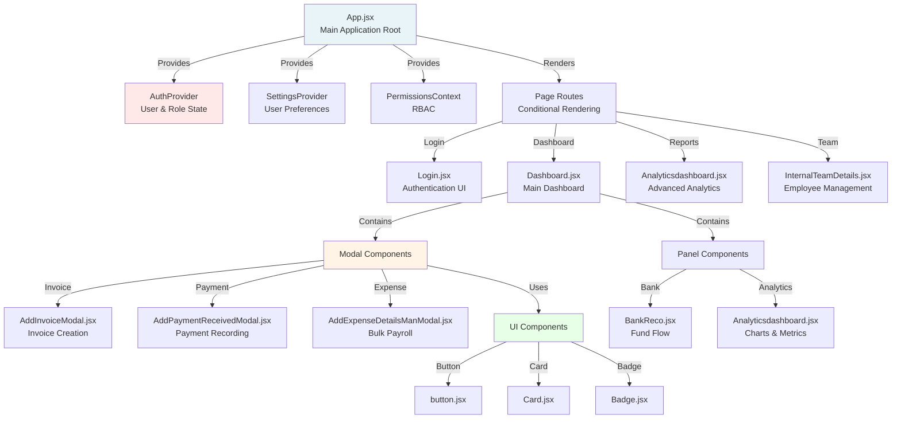
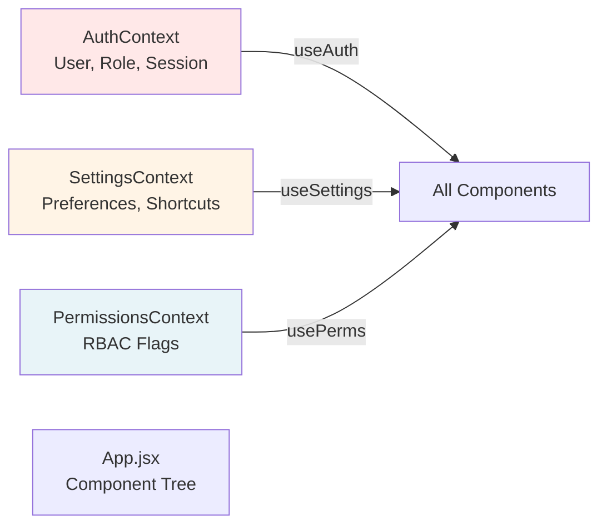

# Verto Frontend Documentation

## Complete Frontend Architecture & Component Guide

---

## Table of Contents

1. [React Component Structure](#react-component-structure)
2. [Context Providers](#context-providers)
3. [Custom Hooks](#custom-hooks)
4. [Component Categories](#component-categories)
5. [Page Components](#page-components)
6. [Modal Components](#modal-components)
7. [UI Components](#ui-components)
8. [Utility Functions](#utility-functions)
9. [Styling Architecture](#styling-architecture)
10. [State Management](#state-management)

---

## React Component Structure

### Component Tree



---

## Context Providers

### 1. AuthContext

**Location:** `src/context/AuthContext.jsx`

**Purpose:** Manages user authentication state and role-based access control

**Exported:**
- `AuthProvider`: Context provider component
- `useAuth()`: Hook to access auth state

**Key Features:**
- JWT token management via Supabase
- User role fetching from `user_roles` table
- Session validation every 3 seconds
- Single-device login enforcement
- "Live Popup" state management
- Session kickout detection

**Data Structure:**
```typescript
interface AuthContextValue {
  user: User | null;           // Supabase user object
  role: 'admin' | 'manager' | 'employee' | 'intern' | null;
  loading: boolean;            // Initial load state
  showLivePopup: boolean;      // "We're Live!" popup flag
  sessionKicked: boolean;      // Multi-device detection flag
  setShowLivePopup: (show: boolean) => void;
}
```

**Exported Functions:**
- Validation RPC: `supabase.rpc('validate_session')`
- Periodic polling every 3000ms

---

### 2. SettingsContext

**Location:** `src/context/SettingsContext.jsx`

**Purpose:** User preferences, appearance, and keyboard shortcuts

**Exported:**
- `SettingsProvider`: Context provider
- `useSettings()`: Hook to access settings

**Settings Categories:**
- **Appearance**: Theme, font, contrast, compact mode
- **Dashboard**: Period filter, landing page
- **Notifications**: Sound, email, frequency
- **Shortcuts**: Keyboard shortcut customization
- **Export**: Default format, settings

**Key Features:**
- LocalStorage persistence
- Per-user shortcut customization (synced to Supabase `user_shortcuts` table)
- Real-time theme application
- CSS variable injection for dynamic styling

---

### 3. PermissionsContext

**Location:** `src/context/PermissionsContext.jsx`

**Purpose:** Role-based permission checks throughout the app

**Exported:**
- `PermissionsContext`: Raw context
- `usePerms()`: Hook to access permissions

**Permission Flags:**
```typescript
interface Permissions {
  role: string;
  loading: boolean;
  isAdmin: boolean;
  isManager: boolean;
  isEmployee: boolean;
  isIntern: boolean;
  canSave: boolean;        // admin, manager
  canEdit: boolean;        // admin, manager
  canDelete: boolean;      // admin only
  canExport: boolean;      // admin, manager
  canImport: boolean;      // admin, manager
  canApprove: boolean;     // admin, manager
  canBulkUpload: boolean;  // admin, manager
}
```

---

## Custom Hooks

### 1. useKeyboardShortcuts

**Location:** `src/hooks/useKeyboardShortcuts.js`

**Purpose:** Global keyboard shortcut handler

**Usage:**
```javascript
const useKeyboardShortcuts = () => {
  // Listens to keyboard events
  // Fires custom events when shortcuts detected
}
```

**Supported Shortcuts:**
- Quick Add: `Ctrl+I` (Invoice), `Ctrl+P` (Payment), `Ctrl+O` (OS Payout), etc.
- Navigation: `Ctrl+D` (Dashboard), `Ctrl+T` (Team), `Ctrl+L` (Ledger)
- Power: `Ctrl+K` (Command Palette), `Ctrl+/` (Help)

**Implementation:**
- Listens to `keydown` events
- Filters out text input fields
- Dispatches custom events
- Subject to `settings.shortcutsEnabled`

---

### 2. usePermissions

**Location:** `src/hooks/usePermissions.js`

**Purpose:** Simplified permission checking

**Usage:**
```javascript
const { isAdmin, canEdit, canDelete } = usePermissions();

if (!canEdit) return <ReadOnlyView />;
```

**Returns:** Permissions object derived from `useAuth().role`

---

### 3. useInternGuard

**Location:** `src/hooks/useInternGuard.js`

**Purpose:** Conditionally render features based on intern status

**Usage:**
```javascript
const { isIntern } = useInternGuard();

if (isIntern) return <div>View-only mode</div>;
```

---

## Component Categories

### Page Components (Full-Page Screens)

| Component | Path | Purpose |
|-----------|------|---------|
| **Login** | `src/pages/Login.jsx` | User authentication |
| **Dashboard** | `src/components/Dashboard.jsx` | Main financial overview |
| **P&L Centerwise** | `src/components/ProfitCenterPL.jsx` | Profit analysis by center |
| **P&L Clientwise** | `src/components/ClientPL.jsx` | Profitability by client |
| **Internal Team Cost** | `src/components/InternalCost.jsx` | Payroll & costs |
| **Internal Team Details** | `src/components/InternalTeamDetails.jsx` | Employee records |
| **Bank & Fund Flow** | `src/components/BankReco.jsx` | Cash flow & reconciliation |
| **Ledger** | `src/components/LedgerPage.jsx` | Transaction history |
| **Petty Cash** | `src/components/PettyCashPage.jsx` | Small transaction tracking |
| **Advance & CC Locker** | `src/components/advance/Advancecreditcardlockerpage.jsx` | Advance tracker |
| **Settings** | `src/components/Settingspage.jsx` | User preferences |
| **Analytics Dashboard** | `src/components/Analyticsdashboard.jsx` | Advanced analytics |
| **Audit Log** | `src/components/Auditlogpage.jsx` | Change tracking |
| **Finance Register** | `src/components/Financeregisterpage.jsx` | Payment center |
| **User Management** | `src/pages/UserManagement.jsx` | Team administration |

---

### Modal Components (Data Entry Forms)

| Component | Purpose | Tables Modified |
|-----------|---------|-----------------|
| **AddInvoiceModal** | Create/edit invoices | `invoices` |
| **AddPaymentReceivedModal** | Record payment received | `payments_received`, `advance_payments` |
| **AddPaymentMadeModal** | Record payment made | `payment_made_manual` |
| **AddExpenseDetailsModal** | Single expense entry | `payment_made_manual` |
| **AddExpenseDetailsManModal** | Bulk payroll upload | `employee_expense_payouts`, `bulk_upload_batches` |
| **AddCNBadDebtModal** | Credit notes & bad debt | `credit_note_bad_debt` |
| **AddBounceBackModal** | Bounced payment tracking | `bounce_back` |
| **AddBankModal** | Bank transaction entry | `bank_entries` |
| **AddEntryModal** | Generic entry creation | Various |
| **AddInternalTeamModal** | Employee record creation | `internal_team` |
| **AddInterestPenaltyModal** | Interest/penalty entry | `interest_penalty` |
| **AddStatutoryPayoutModal** | Statutory payment entry | `statutory_payout` |
| **AddAdvanceLoanModal** | Advance tracker entry | `client_advance_tracker` |
| **AddCreditCardModal** | Credit card entry | `credit_card_bills`, `credit_card_master` |
| **ManageTeamModal** | User & session management | `user_roles`, `sessions` |

---

### UI Components (Reusable)

| Component | Path | Purpose |
|-----------|------|---------|
| **Button** | `src/components/ui/button.jsx` | Styled button component |
| **Card** | `src/components/ui/Card.jsx` | Container card |
| **Badge** | `src/components/ui/Badge.jsx` | Status/tag badges |
| **BorderGlow** | `src/components/ui/BorderGlow.jsx` | Glowing border effect |

---

## Page Components

### App.jsx (Main Application)

**Responsibility:** Application root, navigation, modal management

**Key Features:**
- Tab-based navigation (9 main modules)
- Modal state management for all entry forms
- Keyboard shortcut event listeners
- Sidebar collapse/expand animation
- User profile menu
- Bank data fetching on mount
- Midnight logout enforcement
- Session monitoring

**Navigation Items:**
```javascript
const navItems = [
  { id: "dashboard", label: "Dashboard", icon: LayoutDashboard },
  { id: "pl-center", label: "P&L – Centerwise", icon: TrendingUp },
  { id: "pl-client", label: "P&L – Clientwise", icon: Users },
  { id: "internal-cost", label: "Internal Team Cost", icon: CreditCard },
  { id: "internal-team", label: "Internal Team Details", icon: Users },
  { id: "bank-reco", label: "Bank & Fund Flow", icon: DollarSign },
  { id: "advance-credit-locker", label: "Advance & CC Locker", icon: CreditCard },
  { id: "petty-cash", label: "Petty Cash", icon: Wallet },
  { id: "settings", label: "Settings", icon: Settings }
]
```

**Exported Functions:**
- None (component-only file)

---

### Dashboard.jsx

**Responsibility:** Main financial dashboard view

**Features:**
- Outstanding invoice tracking with real-time updates
- Client P&L summary
- Department-wise cost breakdown
- Payment status overview
- Aging reports
- Quick actions for data entry
- Filters by date range, client, entity

---

### InternalTeamDetails.jsx

**Responsibility:** Employee records management

**Features:**
- Employee CRUD operations
- Cost allocation (Ops, Recruitment, Temp, Projects)
- Client focus tracking
- Excel export with formatting
- Search and filter
- Pagination
- Cost history tracking

**Key Functions:**
- `fetchEmployees()`: Load from `internal_team` table
- `exportToExcel()`: Generate formatted spreadsheet
- `normCostHead()`: Normalize legacy 9-key to 4-key cost structure

---

### Analyticsdashboard.jsx

**Responsibility:** Advanced financial analytics and reporting

**Features:**
- Multi-period financial summaries
- Bank inflow/outflow tracking
- Software expense categorization
- Employee payroll insights
- Profitability analysis
- Interactive charts (Recharts)
- Drill-down capabilities

**Chart Types:**
- Bar charts (monthly comparison)
- Pie charts (category breakdown)
- Line charts (trend analysis)
- Area charts (cumulative)

---

### BankReco.jsx

**Responsibility:** Bank reconciliation and fund flow projection

**Features:**
- Period-wise fund flow buckets
- Income vs expense analysis
- Cash flow projection
- Running balance calculations
- Breakdown by category
- Interactive drill-down

**Period Options:**
- Weekly
- 15 Days
- 25 Days
- Monthly

---

## Modal Components

### AddInvoiceModal

**Location:** `src/components/AddInvoiceModal.jsx`

**Purpose:** Create and edit invoice records

**Database Interaction:**
- Fetches: `bank_master`, `clients_master`
- Inserts/Updates: `invoices` table
- Triggers: Audit logging

**Key Fields:**
```typescript
interface InvoiceFormData {
  invoiceEntity: string;
  department: string;
  client: string;
  invoiceDate: string;
  invoiceNumber: string;
  invoiceValue: number;
  pay: number;           // Base amount
  tdsPercent: number;    // TDS percentage
  tds: number;          // Calculated TDS
  vertoFee: number;     // Service fee
  gst: number;          // GST on fee
  receivableRs: number; // Final receivable amount
  expectedCollectionDate: string;
  bankName: string;
  invoiceDescription: string;
}
```

**Validation:**
- Required fields: Entity, Client, Invoice Number, Amount
- Amount must be > 0
- Invoice date <= Collection date
- GST & TDS calculations auto-computed

**Calculations:**
- TDS = Invoice Value × TDS %
- GST = Verto Fee × 18%
- Net Receivable = Invoice Value - TDS + GST

---

### AddPaymentReceivedModal

**Location:** `src/components/AddPaymentReceivedModal.jsx`

**Purpose:** Record payment received against invoices

**Database Interaction:**
- Reads: `outstanding_invoice_view`, `invoices`, `banks`
- Inserts: `payments_received`, `advance_payments`
- Updates: `invoices` (sets bank_id)

**Key Features:**
- Auto-complete invoice selection
- Outstanding amount validation
- Advance payment reference generation
- Duplicate prevention

**Reference Generation:**
```
Format: PI-{ClientCode}-{DDMMYY}-{Seq}
Example: PI-AC-150126-01
```

---

### AddExpenseDetailsManModal

**Location:** `src/components/AddExpenseDetailsManModal.jsx`

**Purpose:** Bulk payroll entry via Excel upload

**Database Interaction:**
- Inserts: `employee_expense_payouts` (bulk_entry_type)
- Creates: `bulk_upload_batches`
- Logs: Audit trail

**Excel Template Columns:**
```
| Emp Code | Name | Designation | Entity | Department | 
| Payment Head | Payment Description | Amount | TDS | Month |
| Bank | Remarks |
```

**Excel Processing:**
- Header normalization (case-insensitive, flexible spacing)
- Column mapping via `COL_MAP` dictionary
- Date conversion (Excel serial format to ISO)
- Validation before batch insert
- Error reporting per row

**Key Functions:**
```javascript
const COL_MAP = {
  "emp code": "emp_code",
  "emp_code": "emp_code",
  "employee name": "employee_name",
  "payment head": "pay_head",
  // ... 20+ more mappings
}

const normalizeHeader = (h) => String(h || "").trim().toLowerCase();
const excelDateToString = (v) => { /* Excel serial to ISO date */ }
```

**Validation Rules:**
- Emp code required
- Amount > 0
- Month in YYYY-MM format
- Unique records (prevent duplicates)

---

### AddInternalTeamModal

**Location:** `src/components/AddInternalTeamModal.jsx`

**Purpose:** Create/edit employee records

**Database Interaction:**
- Inserts/Updates: `internal_team` table
- References: `departments_master`, `user_roles`

**Key Fields:**
- Name, Email, Designation
- Department, Entity, Location
- Date of Birth, Date of Joining
- CTC, PF, ESI, Variable pay
- Cost head allocation (4 keys: ops, temp, rec, projects)
- Client focus assignment

---

## UI Components

### Button

**Location:** `src/components/ui/button.jsx`

**Props:**
```typescript
interface ButtonProps {
  variant?: 'primary' | 'secondary' | 'danger' | 'ghost';
  size?: 'sm' | 'md' | 'lg';
  disabled?: boolean;
  loading?: boolean;
  onClick?: () => void;
  children: React.ReactNode;
}
```

**Variants:**
- Primary: Blue gradient background
- Secondary: Gray outline
- Danger: Red for destructive actions
- Ghost: Transparent with hover effect

---

### Card

**Location:** `src/components/ui/Card.jsx`

**Purpose:** Container component with consistent styling

**Props:**
```typescript
interface CardProps {
  children: React.ReactNode;
  className?: string;
  clickable?: boolean;
  hoverable?: boolean;
}
```

**Features:**
- Rounded corners
- Shadow on hover
- Border styling
- Responsive padding

---

### Badge

**Location:** `src/components/ui/Badge.jsx`

**Purpose:** Status indicator

**Variants:**
- Success (green)
- Warning (orange)
- Error (red)
- Info (blue)

---

## Utility Functions

### popupManager

**Location:** `src/utils/popupManager.js`

**Purpose:** Session-based popup tracking

**API:**
```javascript
const popupManager = {
  initializeSession(userId),    // Called on SIGNED_IN
  shouldShowPopup(),            // Check if popup should display
  markPopupShown(),            // Mark as shown in current session
  clearSession(),              // Clear on logout
}
```

**Storage Keys:**
- `verto_session_id`: Current session identifier
- `verto_live_popup_shown`: Flag for current session

---

### exportExcel

**Location:** `src/utils/exportExcel.js`

**Purpose:** General Excel export utility

**Functions:**
```javascript
export function exportToExcel(data, filename, sheetName) {
  // Create workbook
  // Format data
  // Write file
}
```

---

### Auditlog

**Location:** `src/utils/Auditlog.js`

**Purpose:** Audit trail creation

**Functions:**
```javascript
export async function logAction(action, category, details) {
  // Insert into audit_logs table
}

export const EXPORT_ACTIONS = {
  EXCEL: 'EXPORT_EXCEL',
  PDF: 'EXPORT_PDF',
  ZIP: 'EXPORT_ZIP',
  // ... more
}
```

---

### shortcutDefaults

**Location:** `src/utils/shortcutDefaults.js`

**Purpose:** Keyboard shortcut configuration

**Exports:**
```javascript
export const SHORTCUT_ACTIONS = [
  { id: "addInvoice", label: "Add Invoice", default: "ctrl+i", ... },
  // ... 20+ more
]

export const DEFAULT_SHORTCUT_MAP = { /* id -> shortcut */ }
export function comboToString(e) { /* KeyboardEvent -> "ctrl+i" */ }
export function formatCombo(combo) { /* "ctrl+i" -> "Ctrl + I" */ }
export function findConflict(shortcuts, combo, excludeId) { /* Detect conflicts */ }
```

---

## Styling Architecture

### Tailwind CSS Integration

**Configuration:** `tailwind.config.js`

**Key Customizations:**
- Color palette extended with brand colors
- Custom spacing scale
- Font size adjustments
- Animation definitions

### CSS Features Used

1. **Glassmorphism**: `backdrop-blur-md`
2. **Gradients**: `bg-gradient-to-r`
3. **Animations**: `animate-spin`, `animate-pulse`
4. **Responsive**: Mobile-first breakpoints (md, lg, xl)
5. **Dark Mode**: CSS custom properties

### Color Palette

```
Primary:    #3b82f6 (Blue)
Secondary:  #6366f1 (Indigo)
Success:    #10b981 (Emerald)
Warning:    #f59e0b (Amber)
Error:      #ef4444 (Red)
Neutral:    #64748b (Slate)
```

---

## State Management

### Global State via Context



### Local State Management

- **Modal States**: `useState` for each modal visibility
- **Form Data**: `useState` for form input values
- **Pagination**: `useState` for current page
- **Filters**: `useState` for active filters
- **Loading States**: `useState` for async operations

### Derived State

- **Permissions**: Computed from `role`
- **Filtered Data**: Computed from search/filter inputs
- **Calculations**: Computed from input values (TDS, GST, etc.)

---

## Performance Optimizations

### Code Splitting

```javascript
const Dashboard = React.lazy(() => import("./components/Dashboard"));
const AnalyticsDashboard = React.lazy(() => import("./components/Analyticsdashboard"));
// ... other heavy components

<Suspense fallback={<Loader />}>
  {activeTab === "dashboard" && <Dashboard />}
</Suspense>
```

### Memoization

- Heavy components wrapped with `React.memo`
- useMemo for expensive calculations
- useCallback for event handlers

### Rendering Optimization

- Virtual scrolling for large lists
- Pagination instead of infinite scroll
- debounced search input
- AnimatePresence for conditional rendering

---

## Best Practices

1. **Error Handling**: Try-catch blocks with user feedback
2. **Loading States**: Show spinners during API calls
3. **Form Validation**: Real-time and submit-time validation
4. **Accessibility**: ARIA labels, semantic HTML
5. **Responsive Design**: Mobile-first approach
6. **Type Safety**: JSDoc comments for prop documentation

---

*For database schema details, see DATABASE_SCHEMA.md*  
*For API specifications, see API_DOCUMENTATION.md*
