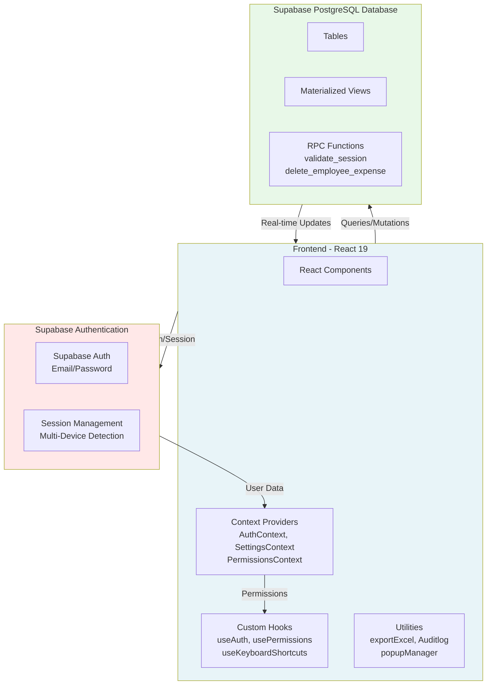
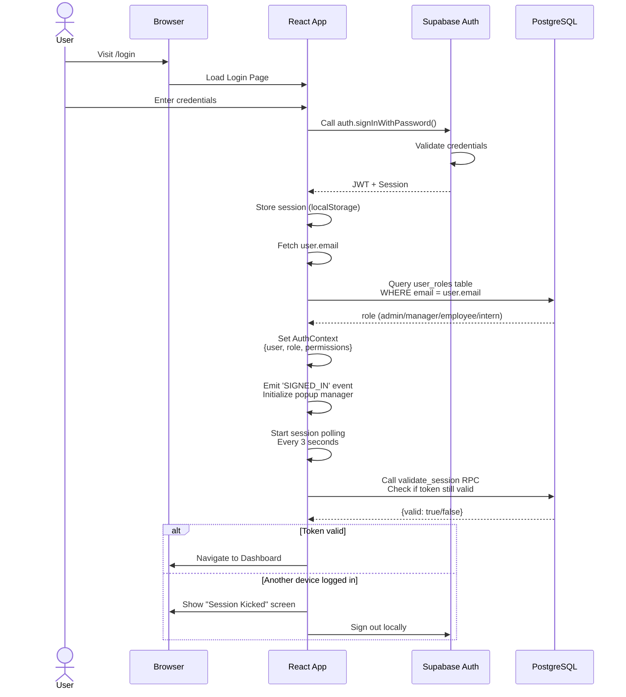
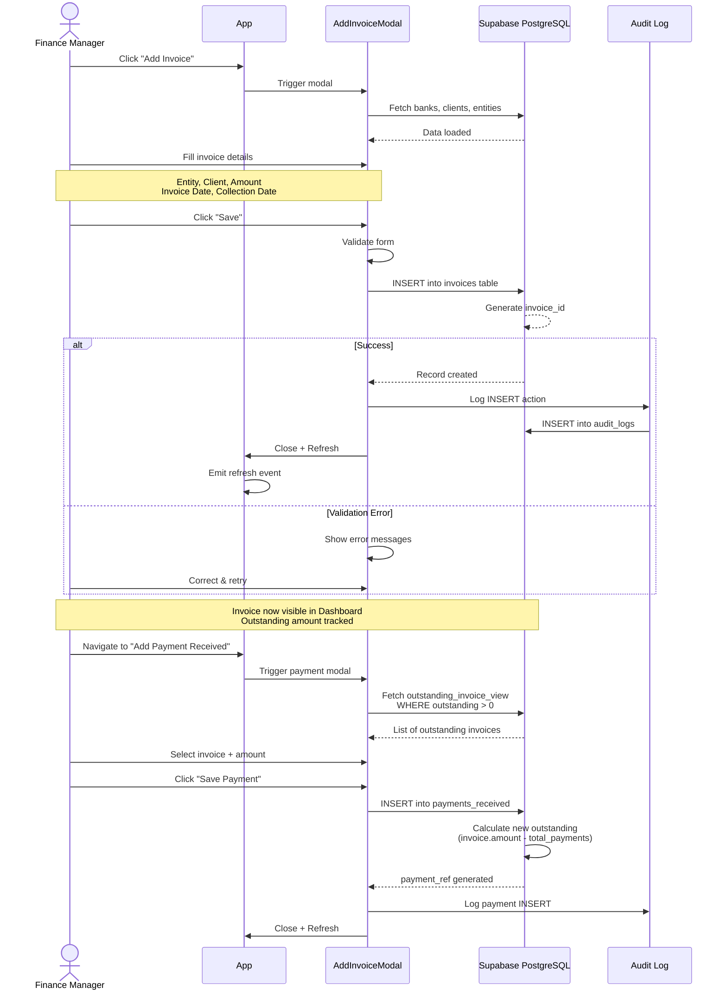
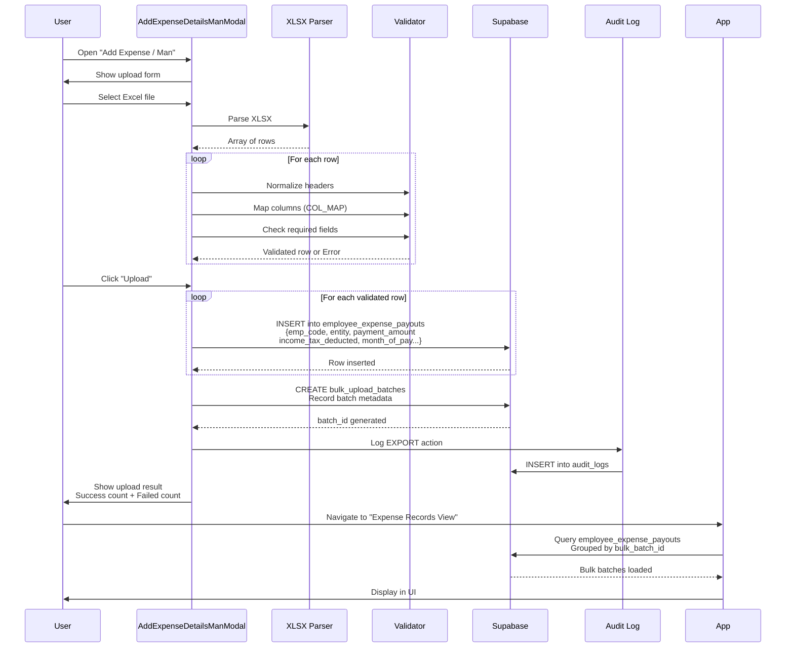
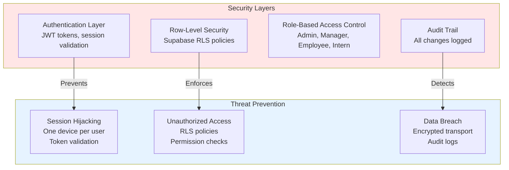
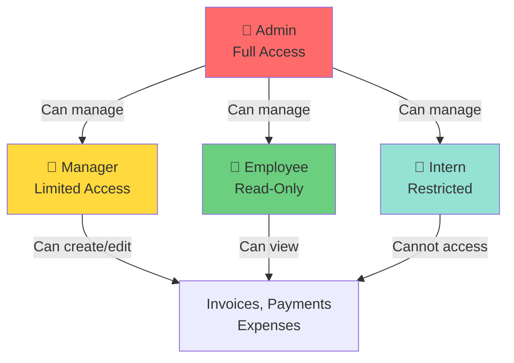

# Verto Financial Dashboard - Project Overview

## Executive Summary

**Verto** is an enterprise-grade financial management dashboard built with React and Vite, powered by Supabase for authentication and PostgreSQL for data persistence. The application is designed for internal finance operations management, providing comprehensive tools for invoice tracking, payment reconciliation, expense management, employee payroll, and financial analysis.

**Version:** 1.0.0  
**Last Updated:** June 2026  
**Tech Stack:** React 19, Vite, Tailwind CSS, Supabase, PostgreSQL  
**Target Users:** Finance Teams, Operations, Internal Auditors

---

## Project Architecture

### High-Level Architecture Diagram



---

## Core Modules & Features

### 1. **Financial Modules**

| Module | Purpose | Key Features |
|--------|---------|--------------|
| **Dashboard** | Overview & Analytics | Invoice tracking, payment status, fund flow projections |
| **Invoices** | Invoice Management | Create, edit, delete invoices; track outstanding amounts |
| **Payments** | Payment Tracking | Payment received, payment made, advance tracking |
| **Bank Reconciliation** | Fund Flow Management | Bank statements, cash flow projections, reconciliation |
| **P&L Analysis** | Profitability | Profit center analysis, client-wise P&L, expense tracking |
| **Internal Team** | Payroll Management | Employee records, salary management, cost allocation |
| **Ledger** | Financial Records | Invoice ledger, transaction history, detailed views |
| **Petty Cash** | Small Transactions | Petty cash entries, history, reconciliation |
| **Statutory Payout** | Compliance | Tax-related payouts, interest, penalties |

### 2. **Administrative Features**

| Feature | Purpose | Access Level |
|---------|---------|--------------|
| **User Management** | Team onboarding & roles | Admin only |
| **Audit Logging** | Track all changes | Admin, Manager |
| **Settings** | Customization | All users |
| **Keyboard Shortcuts** | Productivity | All users (configurable) |
| **Session Monitoring** | Security | Admin only |
| **Analytics Dashboard** | Insights & Reports | Admin, Manager |

---

## Application Flow Diagrams

### User Authentication & Authorization Flow



### Invoice Creation & Payment Tracking Flow



### Bulk Employee Payout Flow



---

## Data Flow Architecture

```mermaid
graph LR
    subgraph Input["Input Sources"]
        Manual["Manual Entry<br/>Modals"]
        Bulk["Bulk Upload<br/>Excel"]
        API["Import API<br/>Future"]
    end
    
    subgraph Processing["Processing Layer"]
        Validation["Validation<br/>Rules Engine"]
        Transform["Data Transform<br/>Normalization"]
        Calc["Calculations<br/>Sum, Balance"]
    end
    
    subgraph Storage["Storage Layer"]
        CoreTables["Core Tables<br/>invoices, payments<br/>employees, expenses"]
        AuditTables["Audit Tables<br/>audit_logs<br/>session_logs"]
    end
    
    subgraph Retrieval["Retrieval Layer"]
        Views["Materialized Views<br/>outstanding_invoice_view<br/>payment_received_full_view"]
        RPC["RPC Functions<br/>validate_session<br/>delete functions"]
    end
    
    subgraph Output["Output Sources"]
        Dashboard["Dashboard<br/>Real-time"]
        Reports["Reports<br/>Excel/PDF"]
        Analytics["Analytics<br/>Charts"]
    end
    
    Input -->|Raw Data| Validation
    Validation -->|Cleaned| Transform
    Transform -->|Structured| Calc
    Calc -->|Final| Storage
    
    Storage -->|Read| Retrieval
    Retrieval -->|Query Results| Output
    
    Storage -->|Audit Trail| AuditTables
    
    style Input fill:#fff4e6
    style Processing fill:#f0f4ff
    style Storage fill:#e6ffe6
    style Retrieval fill:#ffe6e6
    style Output fill:#f4e6ff
```



---

## Technology Stack Details

### Frontend Stack
- **React 19**: Modern UI library with hooks and concurrent features
- **Vite**: Lightning-fast build tool and dev server
- **Tailwind CSS**: Utility-first CSS framework for styling
- **Framer Motion**: Advanced animation library for smooth transitions
- **Lucide React**: Consistent icon library (40+ icons used)
- **Recharts**: Lightweight charting library for financial visualizations
- **XLSX (SheetJS)**: Excel export and import functionality

### Backend & Database
- **Supabase**: Open-source Firebase alternative
  - PostgreSQL 14+ for data storage
  - Real-time subscriptions via WebSocket
  - JWT-based authentication
  - RPC functions for complex operations
  - Row-level security (RLS) policies
  
### Supporting Services
- **Supabase Edge Functions**: Serverless functions for password reset
- **Supabase Real-time**: Live data synchronization

### Development & Deployment
- **ESLint**: Code quality and consistency
- **PostCSS**: CSS processing
- **Git**: Version control
- **Nginx/Vercel**: Deployment options

---

## File Organization

```
Verto/
├── src/
│   ├── components/          # React components (40+ files)
│   │   ├── modals/         # Data entry modals
│   │   ├── pages/          # Full-page views
│   │   ├── ui/             # Reusable UI components
│   │   └── advance/        # Advance & credit card features
│   ├── context/            # React Context providers
│   ├── hooks/              # Custom React hooks
│   ├── lib/                # External service clients
│   ├── utils/              # Utility functions
│   ├── pages/              # Login, user management
│   ├── App.jsx             # Main app component
│   └── main.jsx            # Entry point
├── public/                 # Static assets
├── package.json            # Dependencies
├── vite.config.js          # Vite configuration
├── tailwind.config.js      # Tailwind customization
├── postcss.config.cjs      # PostCSS plugins
├── eslint.config.js        # ESLint rules
└── DOCUMENTATION/          # This documentation
```

---

## Key Metrics & Performance

| Metric | Target | Current Status |
|--------|--------|-----------------|
| **Page Load Time** | < 3s | Optimized with code splitting |
| **API Response Time** | < 500ms | Real-time subscriptions |
| **Bundle Size** | < 2MB | Lazy loading implemented |
| **User Sessions** | 50+ concurrent | Session validation every 3s |
| **Database Queries** | < 200ms | Indexed views & RPC functions |

---

## Security Architecture



---

## Environment Configuration

All sensitive information is managed through environment variables:

```env
# Supabase
VITE_SUPABASE_URL=https://your-project.supabase.co
VITE_SUPABASE_KEY=your-anon-key

# Feature Flags (optional)
VITE_ENABLE_ANALYTICS=true
VITE_SESSION_POLL_INTERVAL=3000
```

---

## User Roles & Permissions

### Role Hierarchy



### Permission Matrix

| Feature | Admin | Manager | Employee | Intern |
|---------|-------|---------|----------|--------|
| Create Invoice | ✅ | ✅ | ❌ | ❌ |
| Edit Invoice | ✅ | ✅ | ❌ | ❌ |
| Delete Invoice | ✅ | ❌ | ❌ | ❌ |
| View Dashboard | ✅ | ✅ | ✅ | ✅ |
| Export Data | ✅ | ✅ | ❌ | ❌ |
| Manage Users | ✅ | ❌ | ❌ | ❌ |
| View Audit Log | ✅ | ✅ | ❌ | ❌ |
| Bulk Upload | ✅ | ✅ | ❌ | ❌ |

---

## Key Dependencies

```json
{
  "dependencies": {
    "react": "^19.0.0",
    "framer-motion": "^11.x.x",
    "recharts": "^2.x.x",
    "@supabase/supabase-js": "^2.x.x",
    "lucide-react": "^0.x.x",
    "xlsx": "^0.18.x"
  },
  "devDependencies": {
    "vite": "^5.x.x",
    "tailwindcss": "^3.x.x",
    "eslint": "^8.x.x",
    "postcss": "^8.x.x"
  }
}
```

---

## Success Metrics

- **User Adoption**: 90% of finance team using daily
- **Data Accuracy**: 99.9% transaction recording accuracy
- **System Uptime**: 99.5% availability
- **Response Time**: Average < 500ms
- **Data Export Success**: 99% error-free exports
- **Audit Compliance**: 100% action tracking

---

## Next Steps & Roadmap

1. **Phase 1** (Complete): Core financial modules
2. **Phase 2** (In Progress): Analytics & reporting
3. **Phase 3** (Planned): Mobile app
4. **Phase 4** (Planned): API for third-party integrations
5. **Phase 5** (Planned): Machine learning for forecasting

---

## Support & Maintenance

- **Issue Tracking**: GitHub Issues
- **Documentation**: Markdown files in `/DOCUMENTATION`
- **Code Reviews**: Pull request workflow
- **Deployment**: Continuous deployment on main branch push
- **Monitoring**: Real-time error tracking via Sentry (planned)

---

*For detailed technical documentation, refer to other markdown files in this documentation folder.*
