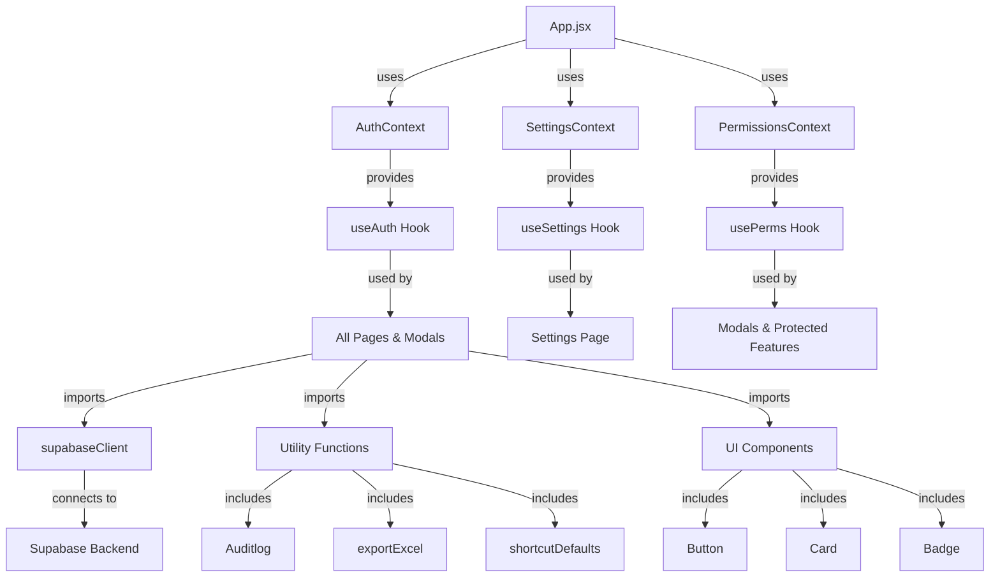

# Component Hierarchy & Tree

## Component Architecture Overview

Complete component tree showing parent-child relationships, props, state, and dependencies.

---

## App Component Tree

### Root Level

```
App.jsx
├── SettingsProvider
│   └── AuthProvider
│       ├── PermissionsContext.Provider
│       └── Content (Tab Navigation)
│           ├── Navigation Bar
│           ├── Modal Layer (Portal)
│           ├── Command Palette
│           ├── Shortcuts Help
│           ├── Live Popup
│           ├── Session Monitor
│           ├── Intern Mode Banner
│           └── Lazy-Loaded Pages
```

---

## Complete Component Hierarchy

```mermaid
graph TD
    A["App.jsx"] --> B["AuthProvider"]
    B --> C["SettingsProvider"]
    C --> D["PermissionsContext"]
    
    D --> E["Navigation & Header"]
    D --> F["Tab Content"]
    D --> G["Modal Portal"]
    D --> H["Support Components"]
    
    E --> E1["Nav Bar"]
    E --> E2["User Menu"]
    E --> E3["Logo"]
    
    F --> F1["Dashboard"]
    F --> F2["ProfitCenterPL"]
    F --> F3["ClientPL"]
    F --> F4["InternalCost"]
    F --> F5["BankReco"]
    F --> F6["InternalTeamDetails"]
    F --> F7["LedgerPage"]
    F --> F8["PettyCashPage"]
    F --> F9["AdvanceCreditCardLockerPage"]
    F --> F10["SettingsPage"]
    F --> F11["AnalyticsDashboard"]
    F --> F12["AuditLogPage"]
    F --> F13["FinanceRegisterPage"]
    
    G --> G1["AddInvoiceModal"]
    G --> G2["AddPaymentReceivedModal"]
    G --> G3["AddPaymentMadeModal"]
    G --> G4["AddExpenseDetailsModal"]
    G --> G5["AddInternalTeamModal"]
    G --> G6["AddCNBadDebtModal"]
    G --> G7["AddBounceBackModal"]
    G --> G8["... More Modals"]
    
    H --> H1["LivePopup"]
    H --> H2["SessionMonitor"]
    H --> H3["CommandPalette"]
    H --> H4["ShortcutsHelp"]
    H --> H5["InternModeBanner"]
```



---

## Dashboard Component & Children

```
Dashboard.jsx
├── Props: (none - uses context)
├── State:
│   ├── invoices (array)
│   ├── payments (array)
│   ├── searchQuery (string)
│   ├── filterEntity (string)
│   ├── activeModal (string)
│   ├── selectedInvoice (object)
│   └── ... more state
├── Hooks:
│   ├── useAuth()
│   ├── usePermissions()
│   ├── useState
│   ├── useCallback
│   └── useMemo
├── Children:
│   ├── Card (UI)
│   │   ├── StatsCard (stat-card component)
│   │   ├── InvoiceTableCard
│   │   └── ChartCard (Recharts)
│   ├── AddInvoiceModal (portal)
│   ├── AddPaymentReceivedModal (portal)
│   ├── AddPaymentMadeModal (portal)
│   ├── AddCNBadDebtModal (portal)
│   ├── BounceHistoryDrawer
│   ├── CNHistoryDrawer
│   ├── PaymentHistoryDrawer
│   ├── PaymentMadeHistoryDrawer
│   ├── InvoiceDetailsDrawer
│   └── Button (UI)
└── Dependencies:
    ├── supabaseClient
    ├── exportToExcel
    ├── Framer Motion
    ├── Lucide React
    └── Recharts
```

---

## Modal Component: AddInvoiceModal

### Props
```javascript
{
  isOpen: boolean,           // Modal visibility
  onClose: () => void,       // Close handler
  onSuccess: () => void,     // Success callback
  existingInvoice?: object   // For edit mode
}
```

### State Variables
```javascript
{
  entity: string,
  client: string,
  invoiceAmount: number,
  invoiceDate: string,
  description: string,
  tags: string[],
  errors: { [key]: string },
  loading: boolean,
  clients: array,            // Fetched from clients_master
  entities: array,           // Fetched from entities_master
  departments: array,        // Fetched from departments_master
  banks: array,              // Fetched from bank_master
  showClientCreate: boolean  // For creating new client
}
```

### Child Components
```javascript
Modal (animated)
├── Form
│   ├── Input fields
│   ├── Select dropdowns
│   ├── DatePicker
│   ├── SearchInput (ClientSearchInput)
│   └── TagInput
├── Button (Save)
├── Button (Cancel)
└── ErrorDisplay
```

### Dependencies
```javascript
{
  supabaseClient: // INSERT invoices, SELECT masters
  useAuth: // Get user email for audit log
  usePerms: // Check canSave permission
  Framer Motion: // Modal animation
  Auditlog: // Log the action
  Lucide React: // Icons
}
```

### Data Flow
```
1. Mount → Fetch master tables
2. User fills form
3. Submit → Validate
4. If valid → INSERT invoice + audit_log
5. If success → Close modal → Call onSuccess
6. Dashboard parent refreshes data
```

---

## Page Component: InternalTeamDetails

### Props: None (Uses context)

### State
```javascript
{
  team: array,               // Employees from internal_team
  filters: object,           // Active filters
  sorting: { field, order },
  selectedRows: Set,         // Multi-select
  modalOpen: boolean,
  editingEmployee: object,
  costHistory: array,        // Employee cost tracking
  loading: boolean,
  error: string
}
```

### Child Components
```javascript
InternalTeamDetails
├── Header
│   ├── Title
│   ├── ActionButtons
│   └── ExportButton
├── Filters
│   ├── SearchInput
│   ├── DepartmentFilter
│   └── EntityFilter
├── DataTable
│   ├── Header row
│   └── Rows (with edit/delete buttons)
├── Pagination
├── AddInternalTeamModal (portal)
└── DeleteConfirmationDialog (portal)
```

### Dependencies
```javascript
{
  supabaseClient: // SELECT internal_team, DELETE
  useAuth: // Get user for audit log
  usePermissions: // Check canDelete, canEdit
  exportToExcel: // Export employees
  Auditlog: // Log changes
}
```

---

## Lazy-Loaded Page Components

### ProfitCenterPL.jsx
```
Props: None
State:
  ├── data (profit center data)
  ├── filters
  ├── period
  └── loading
Children:
  ├── Filters
  ├── Recharts BarChart
  ├── StatsCards
  └── ExportButton
Dependencies:
  ├── supabaseClient
  ├── useAuth
  ├── Recharts
  └── exportToExcel
```

### Analyticsdashboard.jsx
```
Props: None
State:
  ├── invoices
  ├── payments
  ├── expenses
  ├── selectedKPI
  ├── dateRange
  └── loading
Children:
  ├── KPI Cards
  ├── Recharts LineChart (trends)
  ├── Recharts PieChart (distribution)
  ├── Recharts BarChart (comparison)
  ├── Filters
  └── ExportButton
Dependencies:
  ├── supabaseClient
  ├── useAuth
  ├── Recharts
  ├── exportToExcel
  └── Lucide React
```

### BankReco.jsx
```
Props: None
State:
  ├── bankData
  ├── selectedBank
  ├── reconciliation
  ├── loading
  └── filters
Children:
  ├── BankSelector
  ├── Recharts Charts
  ├── ReconciliationTable
  └── MatchingUI
Dependencies:
  ├── supabaseClient
  ├── Recharts
  └── useAuth
```

---

## UI Components (Shared)

### Button.jsx
```javascript
Props: {
  variant: 'primary' | 'secondary' | 'danger' | 'ghost',
  size: 'sm' | 'md' | 'lg',
  children: ReactNode,
  onClick: function,
  disabled: boolean,
  loading: boolean,
  icon: ReactNode,
  className: string
}

Usage: Used in all modals, pages, tables
```

### Card.jsx
```javascript
Props: {
  title: string,
  children: ReactNode,
  footer: ReactNode,
  className: string,
  elevation: 'sm' | 'md' | 'lg'
}

Usage: Data display containers
```

### Badge.jsx
```javascript
Props: {
  variant: 'success' | 'warning' | 'error' | 'info',
  children: ReactNode,
  size: 'sm' | 'md'
}

Usage: Status indicators
```

### BorderGlow.jsx
```javascript
Props: {
  color: string,
  children: ReactNode,
  intensity: 'low' | 'medium' | 'high'
}

Usage: Animated glowing borders
```

---

## Portal Components (Modals & Drawers)

### Modal Portal Architecture
```
All modals rendered at root level via React Portal
├── Visible only when modal.isOpen = true
├── Click outside closes modal (optional)
├── Escape key closes modal
└── Only one primary modal visible at a time
```

### Modal Stack
```javascript
// In App.jsx
const [modals, setModals] = useState({
  addInvoice: false,
  addPayment: false,
  addExpense: false,
  addInternal: false,
  // ... etc
})

// Render order (only active modals shown)
{modals.addInvoice && <AddInvoiceModal />}
{modals.addPayment && <AddPaymentReceivedModal />}
// ... etc
```

### Drawer vs Modal Difference
```
Modals:        Full-screen overlay, centered dialog
Drawers:       Side panel, slides in from right
Dialogues:     Confirmation prompts, small dialogs
```

---

## Component Dependencies Graph



---

## Component-to-Table Mapping

| Component | Primary Table | Secondary Tables | Operation |
|-----------|---------------|------------------|-----------|
| Dashboard | invoices | payments_received, bounce_back | SELECT, real-time sub |
| AddInvoiceModal | invoices | entities_master, clients_master | INSERT, SELECT |
| AddPaymentReceivedModal | payments_received | invoices, outstanding_invoice_view | INSERT, SELECT |
| InternalTeamDetails | internal_team | employee_expense_payouts | SELECT, UPDATE, DELETE |
| AddExpenseDetailsManModal | employee_expense_payouts | bulk_upload_batches | INSERT (bulk) |
| ProfitCenterPL | invoices, payments | All financial tables | SELECT |
| Analyticsdashboard | All tables | Views | SELECT |
| BankReco | payment_made_manual | invoices, payments | SELECT |
| AuditLogPage | audit_logs | None | SELECT |

---

## State Management Patterns

### Local Component State
```javascript
// Used for UI state within a component
const [isOpen, setIsOpen] = useState(false)
const [filters, setFilters] = useState({})
const [loading, setLoading] = useState(false)
```

### Context State
```javascript
// Used across multiple components
AuthContext.user        // Current user
AuthContext.role        // User role
SettingsContext.shortcuts  // User shortcuts
```

### Form State
```javascript
// In modals and forms
const [formData, setFormData] = useState({
  field1: '',
  field2: '',
  // ...
})

const handleChange = (e) => {
  const { name, value } = e.target
  setFormData(prev => ({ ...prev, [name]: value }))
}
```

---

## Re-render Optimization

### Memoization Used
```javascript
// Prevent unnecessary re-renders
const memoizedData = useMemo(() => 
  computeExpensiveData(data), 
  [data]
)

const handleCallback = useCallback(() => {
  // Callback logic
}, [dependencies])
```

### Lazy Loading
```javascript
// In App.jsx
const Dashboard = React.lazy(() => import('./components/Dashboard'))
const Analytics = React.lazy(() => import('./components/Analyticsdashboard'))

// Render with Suspense
<Suspense fallback={<Loading />}>
  <Dashboard />
</Suspense>
```

---

## Component Naming Conventions

✅ **Correct**:
- `AddInvoiceModal.jsx` - Clear purpose
- `InternalTeamDetails.jsx` - Descriptive
- `PaymentHistoryDrawer.jsx` - Type-specific

❌ **Avoid**:
- `Modal1.jsx` - Too generic
- `Data.jsx` - Unclear purpose
- `Component.jsx` - Meaningless

---

## Key Performance Patterns

### Heavy Components
⚠️ These render expensive logic - watch for re-renders:
- `Dashboard.jsx` - Multiple charts, large tables
- `Analyticsdashboard.jsx` - Multiple Recharts instances
- `InternalTeamDetails.jsx` - Large employee lists

### Light Components
✅ These render quickly:
- UI components (Button, Card, Badge)
- Drawers (InvoiceDetailsDrawer)
- Modals (unless data-heavy)

---

## Testing Component Isolation

### Components can be tested independently:

```javascript
// Test Dashboard without auth
<PermissionsContext.Provider value={mockPerms}>
  <Dashboard />
</PermissionsContext.Provider>
```

### Mock Supabase for tests:
```javascript
const mockSupabase = {
  from: jest.fn().mockReturnValue({
    select: jest.fn().mockResolvedValue({ data: [] })
  })
}
```

---

## Next Steps

1. **Review system flows**: [SYSTEM_FLOW.md](SYSTEM_FLOW.md)
2. **Understand contexts**: [CONTEXTS.md](CONTEXTS.md)
3. **Learn about hooks**: [HOOKS.md](HOOKS.md)
