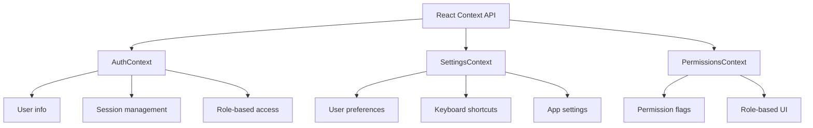
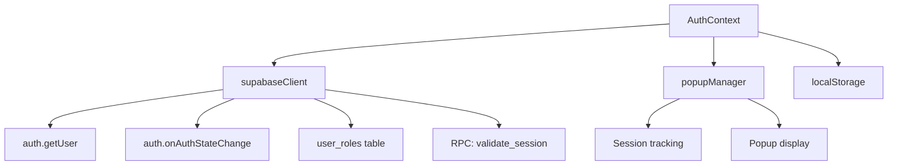
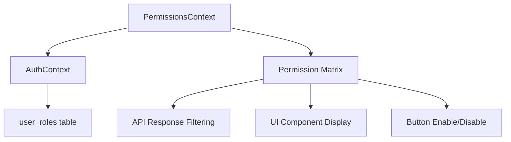

# Context Providers & Global State

## Global State Management Architecture

Complete reference for all Context Providers: state, functions, effects, and consumers.

---

## Context Overview



---

## 1. AuthContext

### Purpose
Manages user authentication, session validation, and multi-device detection.

### File Location
`src/context/AuthContext.jsx`

### State Variables

```javascript
{
  user: {
    id: string,
    email: string,
    // ... other Supabase user fields
  } | null,

  role: 'admin' | 'manager' | 'employee' | 'intern' | null,

  loading: boolean,           // Initial auth check in progress

  showLivePopup: boolean,    // Show "We're Live!" popup

  sessionKicked: boolean,    // User kicked out from another device
}
```

### State Details

#### `user`
- **Type**: Supabase user object or null
- **Set by**: `supabase.auth.getUser()`
- **When set**: On app load and when auth state changes
- **Reset on**: Sign out

#### `role`
- **Type**: String or null
- **Set by**: Query to `user_roles` table via `fetchRole(email)`
- **When set**: After user fetched, on sign-in
- **Determines**: Access control, permissions

#### `loading`
- **Type**: Boolean
- **Initial value**: true
- **When false**: Auth initialization complete
- **Usage**: Show loading spinner until auth resolved

#### `showLivePopup`
- **Type**: Boolean
- **Set by**: `popupManager.shouldShowPopup()`
- **When true**: Show "We're Live!" popup once per session
- **Reset by**: `handleClosePopup()` or sign-out

#### `sessionKicked`
- **Type**: Boolean
- **Set to true when**: Another device logs in with same account
- **Triggers**: Forced sign-out, "You've been signed out" screen
- **Reset on**: Sign-out

### Functions

#### `fetchRole(email)`
**Purpose**: Fetch user role from database

**Parameters**:
- `email` (string) - User email

**Implementation**:
```javascript
const { data } = await supabase
  .from("user_roles")
  .select("role")
  .eq("email", email)
  .single();
setRole(data?.role || null);
```

**Returns**: void (updates state)

**Table used**: `user_roles`

**Memoization**: Uses `fetchedEmailRef` to prevent duplicate calls

#### `validateSession()`
**Purpose**: Validate that current browser's session is still active

**Implementation**:
```javascript
const email = localStorage.getItem("verto_user_email");
const token = localStorage.getItem("verto_session_token");

const { data, error } = await supabase.rpc("validate_session", {
  p_email: email,
  p_token: token,
});

if (error || !data?.valid) {
  // Kick out user
  setSessionKicked(true);
  await supabase.auth.signOut();
}
```

**Parameters**: None (uses localStorage)

**Returns**: void (updates state or signs out)

**RPC Function Used**: `validate_session(p_email, p_token)`

**Frequency**: Called every 3 seconds via polling

**Side Effects**: May clear localStorage, sign out user

#### `startSessionPolling()`
**Purpose**: Begin polling session validation every 3 seconds

**Implementation**:
```javascript
const startSessionPolling = useCallback(() => {
  clearInterval(sessionCheckIntervalRef.current);
  sessionCheckIntervalRef.current = setInterval(() => {
    validateSession();
  }, 3000);
}, [validateSession]);
```

**Returns**: void

**Sets**: `sessionCheckIntervalRef` with interval ID

**Cleans up**: On unmount and sign-out

#### `handleClosePopup()`
**Purpose**: Dismiss "We're Live!" popup and mark as shown

**Implementation**:
```javascript
const handleClosePopup = () => {
  popupManager.markPopupShown();
  setShowLivePopup(false);
};
```

**Returns**: void

**Side Effects**: Updates sessionStorage

### Effects

#### Initial Auth Check
**Triggers on**: Component mount

**Does**:
1. Get current user via `supabase.auth.getUser()`
2. If user exists: fetch role, validate session, start polling
3. Set loading = false

#### Auth State Listener
**Triggers on**: Component mount

**Listens for**: 
- `SIGNED_IN` - User logged in
- `SIGNED_OUT` - User logged out
- Auth state changes

**On SIGNED_IN**:
- Initialize popup session
- Show popup if first time
- Start polling

**On SIGNED_OUT**:
- Clear all auth state
- Clear popup manager
- Clear polling interval

### Context Provider Props
```javascript
<AuthProvider children={ReactNode} />
```

### Context Value Exposed
```javascript
{
  user,
  role,
  loading,
  showLivePopup,
  sessionKicked,
  setShowLivePopup: handleClosePopup  // Function to close popup
}
```

### Hook to Access
```javascript
import { useAuth } from '../context/AuthContext'

export const useAuth = () => useContext(AuthContext)
```

### Used By (Consumers)
- Nearly all components
- `App.jsx` - Check authentication status
- `Dashboard.jsx` - Get user email for logging
- `AddInvoiceModal.jsx` - Check permissions
- `SessionMonitor.jsx` - Display session info
- `LivePopup.jsx` - Show popup
- `PermissionsContext.jsx` - Derive permissions from role

### Dependency Diagram



---

## 2. SettingsContext

### Purpose
Manages user preferences, application settings, and keyboard shortcuts.

### File Location
`src/context/SettingsContext.jsx`

### State Variables

```javascript
{
  settings: {
    // Appearance
    colorMode: 'light' | 'dark',
    nightLight: 'normal' | 'soft' | 'bright',
    contrast: 'normal' | 'high',
    fontSize: 'small' | 'medium' | 'large',
    fontFamily: 'inter' | 'system' | 'serif',
    compactMode: 'normal' | 'compact',

    // Dashboard
    dashboardPeriod: 'week' | 'month' | 'quarter' | 'year',
    landingPage: 'dashboard' | 'analytics' | 'custom',
    currencyFormat: 'indian' | 'western' | 'accounting',

    // Notifications
    soundNotifications: boolean,
    soundPaymentReceived: boolean,
    soundInvoiceAdded: boolean,
    desktopNotifications: boolean,
    dailySummary: boolean,

    // Productivity
    autoRefresh: 'off' | '30s' | '1m' | '5m',
    stickyFilters: boolean,
    quickSearch: boolean,

    // Finance
    numberDisplay: 'indian' | 'western',
    negativeDisplay: 'parens' | 'minus' | 'red',
    profitColor: 'green' | 'blue' | 'purple',

    // Keyboard Shortcuts
    shortcutsEnabled: boolean,
    shortcutAddInvoice: boolean,
    shortcutPaymentReceived: boolean,
    // ... more toggles

    // Advanced
    performanceMode: boolean,
    startupLiveScreen: boolean,
    starBackground: boolean,
  },

  shortcuts: {
    addInvoice: 'ctrl+i',
    paymentReceived: 'ctrl+p',
    osPayout: 'ctrl+o',
    // ... more mappings
  },

  shortcutsLoaded: boolean  // Whether custom shortcuts fetched from DB
}
```

### Settings Storage

**Primary Storage**: localStorage
- **Key**: `verto_app_settings`
- **Format**: JSON string
- **Loaded on**: Component mount
- **Saved on**: Any setting changes

**Secondary Storage**: Supabase `user_shortcuts` table
- **Syncs keyboard shortcuts** between devices
- **Keyed by**: User email

### Functions

#### `loadSettings()`
**Purpose**: Load settings from localStorage with defaults

**Implementation**:
```javascript
function loadSettings() {
  try {
    const raw = localStorage.getItem(STORAGE_KEY);
    if (!raw) return { ...DEFAULTS };
    return { ...DEFAULTS, ...JSON.parse(raw) };
  } catch {
    return { ...DEFAULTS };
  }
}
```

**Returns**: Settings object (merged with defaults)

**Side Effects**: None (read-only)

#### `saveSettings(settings)`
**Purpose**: Save settings to localStorage

**Implementation**:
```javascript
function saveSettings(settings) {
  try {
    localStorage.setItem(STORAGE_KEY, JSON.stringify(settings));
  } catch {}
}
```

**Parameters**: Settings object

**Returns**: void

**Side Effects**: Updates localStorage

#### `updateSetting(key, value)`
**Purpose**: Update a single setting

**Implementation**:
```javascript
const updateSetting = (key, value) => {
  setSettings(prev => {
    const updated = { ...prev, [key]: value };
    saveSettings(updated);
    return updated;
  });
};
```

**Parameters**:
- `key` (string) - Setting name
- `value` (any) - New value

**Returns**: void

**Side Effects**: Updates localStorage

#### `updateShortcut(actionId, combo)`
**Purpose**: Update a single keyboard shortcut

**Implementation**: 
```javascript
const updateShortcut = (actionId, combo) => {
  setShortcuts(prev => {
    const updated = { ...prev, [actionId]: combo };
    saveShortcutsToDatabase(updated);
    return updated;
  });
};
```

**Parameters**:
- `actionId` (string) - Shortcut ID
- `combo` (string) - Key combo like 'ctrl+i'

**Returns**: void

**Side Effects**: Updates localStorage + database

#### `resetToDefaults()`
**Purpose**: Reset all settings to default values

**Parameters**: None

**Returns**: void

**Side Effects**: Clears localStorage, resets state

### Effects

#### Load Settings on Mount
**Triggers on**: Component mount

**Does**:
1. Load settings from localStorage
2. Fetch shortcuts from `user_shortcuts` table
3. Set `shortcutsLoaded = true` once complete

#### Sync Settings Across Tabs
**Triggers on**: Storage event (another tab changed settings)

**Does**: Reload and update state

### Context Provider Props
```javascript
<SettingsProvider children={ReactNode} />
```

### Context Value Exposed
```javascript
{
  settings,
  shortcuts,
  shortcutsLoaded,
  updateSetting,
  updateShortcut,
  resetToDefaults,
  saveSettings
}
```

### Hook to Access
```javascript
import { useSettings } from '../context/SettingsContext'

export const useSettings = () => useContext(SettingsContext)
```

### Used By (Consumers)
- `Settingspage.jsx` - Display and edit settings
- `useKeyboardShortcuts.js` - Get shortcut mappings
- `CommandPalette.jsx` - Display custom shortcuts
- `useSettings()` consumers throughout app

### Default Values (DEFAULTS)

```javascript
{
  colorMode: 'light',
  nightLight: 'normal',
  contrast: 'normal',
  fontSize: 'medium',
  fontFamily: 'inter',
  compactMode: 'normal',
  
  dashboardPeriod: 'month',
  landingPage: 'dashboard',
  currencyFormat: 'indian',
  
  soundNotifications: true,
  soundPaymentReceived: true,
  soundInvoiceAdded: true,
  soundOsPayout: true,
  soundSalary: true,
  desktopNotifications: false,
  dailySummary: false,
  
  autoRefresh: 'off',
  stickyFilters: true,
  quickSearch: true,
  
  numberDisplay: 'indian',
  negativeDisplay: 'parens',
  profitColor: 'green',
  
  shortcutsEnabled: true,
  shortcutAddInvoice: true,
  shortcutPaymentReceived: true,
  // ... more
  
  performanceMode: false,
  startupLiveScreen: true,
  starBackground: true
}
```

---

## 3. PermissionsContext

### Purpose
Provides role-based access control flags and permission checks.

### File Location
`src/context/PermissionsContext.jsx`

### Context Value

```javascript
{
  role: 'admin' | 'manager' | 'employee' | 'intern' | null,
  loading: boolean,
  
  // Role checks
  isAdmin: boolean,
  isManager: boolean,
  isEmployee: boolean,
  isIntern: boolean,
  
  // Permission flags
  canSave: boolean,        // Create records
  canEdit: boolean,        // Modify records
  canDelete: boolean,      // Remove records
  canExport: boolean,      // Export to Excel
  canImport: boolean,      // Bulk upload
  canApprove: boolean,     // Approve transactions
  canBulkUpload: boolean,  // Bulk operations
}
```

### Permission Rules

| Permission | Admin | Manager | Employee | Intern |
|-----------|-------|---------|----------|--------|
| isAdmin | ✓ | ✗ | ✗ | ✗ |
| isManager | ✗ | ✓ | ✗ | ✗ |
| isEmployee | ✗ | ✗ | ✓ | ✗ |
| isIntern | ✗ | ✗ | ✗ | ✓ |
| canSave | ✓ | ✓ | ✗ | ✗ |
| canEdit | ✓ | ✓ | ✗ | ✗ |
| canDelete | ✓ | ✗ | ✗ | ✗ |
| canExport | ✓ | ✓ | ✗ | ✗ |
| canImport | ✓ | ✓ | ✗ | ✗ |
| canApprove | ✓ | ✓ | ✗ | ✗ |
| canBulkUpload | ✓ | ✓ | ✗ | ✗ |

### Derivation Logic

```javascript
export function usePerms() {
  const { role, loading } = useAuth();
  
  return {
    role,
    loading,
    isAdmin: role === 'admin',
    isManager: role === 'manager',
    isEmployee: role === 'employee',
    isIntern: role === 'intern',
    canSave: role === 'admin' || role === 'manager',
    canEdit: role === 'admin' || role === 'manager',
    canDelete: role === 'admin',
    canExport: role === 'admin' || role === 'manager',
    canImport: role === 'admin' || role === 'manager',
    canApprove: role === 'admin' || role === 'manager',
    canBulkUpload: role === 'admin' || role === 'manager',
  };
}
```

**Key**: Derives from `AuthContext.role`

### Hook to Access
```javascript
import { usePerms } from '../context/PermissionsContext'

export function usePerms() {
  const context = useContext(PermissionsContext);
  if (!context) {
    throw new Error('usePerms must be used within PermissionsContext');
  }
  return context;
}
```

### Used By (Consumers)
- `App.jsx` - Show/hide admin features
- `AddInvoiceModal.jsx` - Check canSave
- `InternalTeamDetails.jsx` - Check canDelete
- `Dashboard.jsx` - Show/hide export button
- All modals and protected components

### Common Usage Patterns

```javascript
// Check single permission
if (usePerms().canSave) {
  showSaveButton();
}

// Check role
if (usePerms().isAdmin) {
  showAdminPanel();
}

// Conditional rendering
{usePerms().canExport && <ExportButton />}

// Disable feature for interns
if (usePerms().isIntern) {
  disableFeature();
}
```

### Dependency Diagram



---

## Context Dependency Chain

```
main.jsx
  ├── SettingsProvider
  │   └── AuthProvider
  │       └── PermissionsContext.Provider
  │           └── App content
  │               └── All components
```

**Initialization Order**:
1. SettingsProvider loads user preferences from localStorage
2. AuthProvider checks authentication status, fetches role
3. PermissionsContext derives permissions from role
4. App renders with all contexts available

---

## Updating Context State

### Correct Pattern

```javascript
// In AuthContext
setUser(newUser);      // Triggers re-render of all consumers
setRole(newRole);
```

### Consumer Updates

When context state changes:
1. **AuthContext** notifies all `useAuth()` consumers
2. **SettingsContext** notifies all `useSettings()` consumers
3. **PermissionsContext** re-evaluates permissions based on AuthContext

All consumer components re-render with new values.

---

## Memory & Performance

### Avoid Circular References
✅ **Correct**: PermissionsContext reads from AuthContext
❌ **Wrong**: AuthContext reads from PermissionsContext

### Re-render Optimization
- Use `useCallback` for function props
- Use `useMemo` for derived values
- Wrap expensive consumers in `React.memo`

### State Size
⚠️ **Large state** in context can cause unnecessary re-renders
- SettingsContext has ~40 properties (acceptable)
- AuthContext has ~5 properties (minimal)

---

## Error Handling

### AuthContext Errors
- Invalid credentials: Show login error
- Session kicked: Show forced logout screen
- RPC validation fails: Sign out user

### SettingsContext Errors
- localStorage corrupt: Use defaults
- Database sync fails: Fall back to localStorage

### PermissionsContext Errors
- usePerms outside provider: Error boundary catches
- Role undefined: Return default permissions (read-only)

---

## Testing Contexts

### Mock AuthContext
```javascript
const mockAuthContext = {
  user: { email: 'test@example.com' },
  role: 'admin',
  loading: false,
  showLivePopup: false,
  sessionKicked: false,
};

// Wrap component
<AuthContext.Provider value={mockAuthContext}>
  <Component />
</AuthContext.Provider>
```

### Mock SettingsContext
```javascript
const mockSettings = {
  settings: { shortcutsEnabled: true, fontSize: 'medium' },
  shortcuts: { addInvoice: 'ctrl+i' },
  shortcutsLoaded: true,
  updateSetting: jest.fn(),
  updateShortcut: jest.fn(),
};
```

---

## Next Steps

1. **Learn about hooks**: [HOOKS.md](HOOKS.md)
2. **Review utilities**: [UTILITIES.md](UTILITIES.md)
3. **Check table mappings**: [TABLE_USAGE_MAPPING.md](TABLE_USAGE_MAPPING.md)
