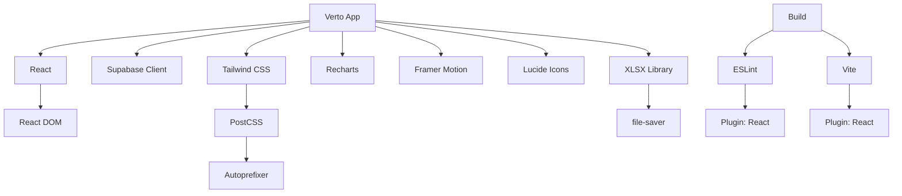

# External Dependencies Reference

## All External Libraries & Packages

Complete reference for every npm package: purpose, version, usage, and file locations.

---

## Dependencies Summary

```
Total Dependencies: 10 production + 7 development
Bundle Size: ~800KB (before optimization)
Main Vendor: Supabase, React, XLSX
```

---

## Production Dependencies

### Core Framework

#### `react@^19.2.0`

**Purpose**: React library for UI components

**Version**: 19.2.0 or compatible

**Used In**: Nearly every file

**Key Features**:
- Component rendering
- Hooks (useState, useEffect, useContext)
- JSX syntax

**Bundle Impact**: ~40KB (with React DOM)

**Examples**:
```javascript
import React, { useState, useEffect } from 'react'

function Component() {
  const [state, setState] = useState(0)
  return <div>{state}</div>
}
```

---

#### `react-dom@^19.2.0`

**Purpose**: React DOM rendering (browser DOM manipulation)

**Version**: 19.2.0 or compatible

**Used In**: `src/main.jsx` entry point

**Key Function**:
```javascript
ReactDOM.createRoot(document.getElementById('root')).render(...)
```

**Bundle Impact**: ~40KB (combined with react)

---

### Backend & Data

#### `@supabase/supabase-js@^2.105.1`

**Purpose**: Supabase client library for database, auth, real-time subscriptions

**Version**: 2.105.1 or compatible

**Used In**:
- `src/lib/supabaseClient.js` - Client initialization
- Nearly every component that fetches/modifies data
- Context providers

**Key Features**:
- Authentication (`supabase.auth.*`)
- Database operations (`supabase.from().select()`, etc.)
- Real-time subscriptions (`.on()`)
- RPC function calls (`.rpc()`)

**Bundle Impact**: ~50KB

**Examples**:
```javascript
import { createClient } from '@supabase/supabase-js'

// Initialize
const supabase = createClient(URL, KEY)

// Fetch data
const { data } = await supabase.from('invoices').select()

// Real-time subscription
supabase.from('invoices').on('*', handleChange).subscribe()
```

---

### Excel & File Export

#### `xlsx@^0.18.5`

**Purpose**: Parse and generate Excel files (.xlsx format)

**Version**: 0.18.5 or compatible

**Used In**:
- `src/utils/exportExcel.js` - Excel export functionality
- `src/components/AddExpenseDetailsManModal.jsx` - Excel parsing
- All export features

**Key Functions**:
- Read Excel: `XLSX.read(file)`
- Create Excel: `XLSX.utils.book_new()`, `json_to_sheet()`
- Download: `XLSX.writeFile(workbook, filename)`

**Bundle Impact**: ~500KB (largest dependency!)

**Examples**:
```javascript
import * as XLSX from 'xlsx'

// Parse Excel file
const workbook = XLSX.read(file, { type: 'array' })
const sheet = workbook.Sheets[workbook.SheetNames[0]]
const data = XLSX.utils.sheet_to_json(sheet)

// Create Excel file
const workbook = XLSX.utils.book_new()
const worksheet = XLSX.utils.json_to_sheet(data)
XLSX.utils.book_append_sheet(workbook, worksheet, 'Sheet1')
XLSX.writeFile(workbook, 'export.xlsx')
```

---

#### `file-saver@^2.0.5`

**Purpose**: Browser file download utility

**Version**: 2.0.5 or compatible

**Used In**: Excel export functionality (triggered by XLSX)

**Key Function**: Triggers browser download dialog

**Bundle Impact**: ~5KB

**Examples**:
```javascript
import { saveAs } from 'file-saver'

// Trigger download
saveAs(blob, 'filename.xlsx')
```

---

### UI & Animation

#### `framer-motion@^12.31.0`

**Purpose**: Animation and motion library

**Version**: 12.31.0 or compatible

**Used In**:
- `src/components/Dashboard.jsx` - Component animations
- `src/components/AddInvoiceModal.jsx` - Modal animations
- `src/App.jsx` - Page transitions

**Key Features**:
- Smooth component animations
- Gesture animations
- Layout animations
- Framer Motion syntax with React components

**Bundle Impact**: ~40KB

**Examples**:
```javascript
import { motion, AnimatePresence } from 'framer-motion'

// Animated component
<motion.div
  initial={{ opacity: 0 }}
  animate={{ opacity: 1 }}
  exit={{ opacity: 0 }}
>
  Content
</motion.div>

// List animations
<AnimatePresence>
  {items.map(item => <motion.div key={item.id}>{item}</motion.div>)}
</AnimatePresence>
```

---

#### `lucide-react@^0.563.0`

**Purpose**: Icon library with React components

**Version**: 0.563.0 or compatible

**Used In**:
- `src/components/Dashboard.jsx` - Dashboard icons
- `src/App.jsx` - Navigation icons
- All modals and components

**Key Features**:
- 1000+ SVG icons as React components
- Customizable size, color, stroke width
- Tree-shakeable (only used icons bundled)

**Bundle Impact**: Variable (tree-shaken, ~20KB typical)

**Examples**:
```javascript
import { 
  Download, 
  Settings, 
  LogOut,
  Plus,
  // ... more icons
} from 'lucide-react'

<Download className="w-4 h-4" />
<Settings size={24} strokeWidth={1.5} />
```

**Common Icons Used**:
- Download, Upload, Export
- Settings, Gear, Lock
- Plus, Minus, X, Check
- ChevronDown, ChevronUp, ArrowRight
- AlertCircle, CheckCircle2, Activity
- Users, DollarSign, TrendingUp
- Calendar, Search, Filter, Edit3

---

#### `recharts@^3.7.0`

**Purpose**: React charting library for data visualization

**Version**: 3.7.0 or compatible

**Used In**:
- `src/components/Dashboard.jsx` - Charts
- `src/components/Analyticsdashboard.jsx` - Analytics charts
- `src/components/ProfitCenterPL.jsx` - P&L charts
- `src/components/BankReco.jsx` - Bank reconciliation charts

**Key Features**:
- Line, Bar, Pie, Area charts
- Responsive charts
- Tooltips and legends
- Smooth animations
- Composed charts (multiple chart types)

**Bundle Impact**: ~40KB

**Examples**:
```javascript
import {
  LineChart, BarChart, PieChart,
  Line, Bar, Pie,
  CartesianGrid, Tooltip, Legend, XAxis, YAxis
} from 'recharts'

<BarChart data={data}>
  <CartesianGrid strokeDasharray="3 3" />
  <XAxis dataKey="name" />
  <YAxis />
  <Tooltip />
  <Bar dataKey="value" fill="#8884d8" />
</BarChart>
```

---

### Utilities

#### `bcryptjs@^3.0.3`

**Purpose**: Password hashing and validation (if needed)

**Version**: 3.0.3 or compatible

**Usage**: May be used for client-side password validation

**Bundle Impact**: ~30KB

**Note**: Supabase handles password hashing on server

---

#### `canvas-confetti@^1.9.4`

**Purpose**: Celebrate animations (confetti effect)

**Version**: 1.9.4 or compatible

**Used In**: Success animations (optional celebratory feature)

**Bundle Impact**: ~15KB

**Examples**:
```javascript
import confetti from 'canvas-confetti'

confetti({
  particleCount: 100,
  spread: 70,
  origin: { y: 0.6 }
})
```

---

#### `clsx@^2.1.1`

**Purpose**: Conditional CSS class names

**Version**: 2.1.1 or compatible

**Used In**: Components with conditional styling

**Bundle Impact**: ~2KB

**Examples**:
```javascript
import clsx from 'clsx'

<button className={clsx(
  'px-4 py-2 rounded',
  {
    'bg-blue-500': isActive,
    'bg-gray-300': !isActive,
  }
)}>
  Button
</button>
```

---

#### `tailwind-merge@^3.4.0`

**Purpose**: Merge Tailwind CSS classes intelligently

**Version**: 3.4.0 or compatible

**Used In**: UI component merging class conflicts

**Bundle Impact**: ~1KB

**Examples**:
```javascript
import { twMerge } from 'tailwind-merge'

const buttonClasses = twMerge(
  'px-4 py-2 rounded bg-blue-500',
  'bg-red-500'  // This overrides the blue
)
// Result: 'px-4 py-2 rounded bg-red-500'
```

---

## Development Dependencies

### Build & Vite

#### `vite@^7.2.4`

**Purpose**: Fast build tool and dev server

**Version**: 7.2.4 or compatible

**Used In**: 
- `npm run dev` - Development server
- `npm run build` - Production build
- `vite.config.js` - Configuration

**Key Commands**:
```bash
npm run dev      # Start dev server on localhost:5173
npm run build    # Build for production
npm run preview  # Preview production build locally
```

---

#### `@vitejs/plugin-react@^5.1.1`

**Purpose**: Vite plugin for React support (JSX, HMR)

**Version**: 5.1.1 or compatible

**Used In**: `vite.config.js`

**Features**:
- JSX transformation
- Hot module replacement (HMR)
- React Fast Refresh

---

### CSS & Styling

#### `tailwindcss@^4.1.18`

**Purpose**: Utility-first CSS framework

**Version**: 4.1.18 or compatible

**Used In**:
- All components (Tailwind classes)
- `tailwind.config.js` - Configuration
- `postcss.config.cjs` - PostCSS integration
- `src/index.css` - Global styles

**Key Features**:
- Responsive utilities
- Dark mode
- Custom theme
- JIT compilation

**Examples**:
```html
<div className="px-4 py-2 rounded bg-blue-500 hover:bg-blue-600">
  Button
</div>
```

---

#### `@tailwindcss/postcss@^4.1.18`

**Purpose**: Tailwind CSS PostCSS plugin

**Version**: 4.1.18 or compatible

**Used In**: `postcss.config.cjs`

---

#### `postcss@^8.5.6`

**Purpose**: CSS transformation tool

**Version**: 8.5.6 or compatible

**Used In**: `postcss.config.cjs` with Tailwind

**Configuration**:
```javascript
module.exports = {
  plugins: {
    tailwindcss: {},
    autoprefixer: {},
  },
}
```

---

#### `autoprefixer@^10.4.24`

**Purpose**: Add vendor prefixes to CSS (-webkit-, -moz-, etc.)

**Version**: 10.4.24 or compatible

**Used In**: PostCSS pipeline (automatic)

---

### Linting

#### `eslint@^9.39.1`

**Purpose**: JavaScript linter for code quality

**Version**: 9.39.1 or compatible

**Used In**: `npm run lint`

**Configuration**: `eslint.config.js`

**Common Issues Checked**:
- Unused variables
- Undefined variables
- React hooks rules
- Best practices

---

#### `@eslint/js@^9.39.1`

**Purpose**: ESLint JavaScript configurations

**Version**: 9.39.1 or compatible

**Used In**: `eslint.config.js`

---

#### `eslint-plugin-react-hooks@^7.0.1`

**Purpose**: ESLint plugin for React hooks best practices

**Version**: 7.0.1 or compatible

**Checks**:
- Hooks called at top level
- Dependencies array completeness
- Proper hook usage patterns

---

#### `eslint-plugin-react-refresh@^0.4.24`

**Purpose**: ESLint plugin for React Fast Refresh

**Version**: 0.4.24 or compatible

**Checks**: React component export rules for HMR

---

### Type Checking & Configuration

#### `@types/react@^19.2.5`

**Purpose**: TypeScript type definitions for React

**Version**: 19.2.5 or compatible

**Used In**: IDE autocomplete, optional TypeScript

---

#### `@types/react-dom@^19.2.3`

**Purpose**: TypeScript type definitions for React DOM

**Version**: 19.2.3 or compatible

**Used In**: IDE autocomplete, optional TypeScript

---

#### `globals@^16.5.0`

**Purpose**: Global variable type definitions

**Version**: 16.5.0 or compatible

**Used In**: ESLint configuration for browser globals

---

## Dependency Tree Visualization



---

## Bundle Size Breakdown

```
Production Build (~800KB):
├── React + ReactDOM       ~40KB
├── Supabase Client        ~50KB
├── XLSX Library          ~500KB (largest!)
├── Recharts               ~40KB
├── Framer Motion          ~40KB
├── Lucide Icons           ~20KB
├── Tailwind CSS           ~50KB
├── Other utilities        ~60KB
└── Your code              ~30KB
```

**Optimization**: XLSX library is 60% of bundle. Consider:
- Lazy load XLSX (dynamic import)
- Use server-side for bulk uploads
- Use lightweight alternatives for simple exports

---

## Updating Dependencies

### Check for Outdated Packages

```bash
npm outdated
```

### Update All Dependencies

```bash
npm update
```

### Update Specific Package

```bash
npm install package@latest
```

### Major Version Update

```bash
npm install package@latest --save
# Manually test for breaking changes
```

### Lock Dependencies (Safer)

```bash
# npm automatically locks in package-lock.json
npm ci  # Install exact versions from lock file
```

---

## Common Issues & Solutions

### Issue: "Cannot find module 'react'"

**Solution**:
```bash
npm install
npm run dev
```

### Issue: "tailwindcss is not installed"

**Solution**:
```bash
npm install tailwindcss autoprefixer postcss
```

### Issue: JSX not recognized

**Solution**: Ensure `@vitejs/plugin-react` is installed and configured

### Issue: Import errors for .jsx files

**Solution**: All imports should include `.jsx` extension or use module resolution

---

## Performance Optimization

### Code Splitting

Vite already handles this in `vite.config.js`:
```javascript
manualChunks: {
  'vendor-react': ['react', 'react-dom'],
  'vendor-motion': ['framer-motion'],
  'vendor-supabase': ['@supabase/supabase-js'],
  // ... more
}
```

### Lazy Loading Libraries

```javascript
// Good: Load only when needed
const { exportToExcel } = await import('../utils/exportExcel')

// Used in: Export button click handler
async function handleExport() {
  const { exportToExcel } = await import('../utils/exportExcel')
  exportToExcel(data, filename)
}
```

### Tree Shaking

Unused code is removed during build:
```javascript
// If only Download icon is used from lucide-react
import { Download } from 'lucide-react'

// Only Download is bundled, not all icons
```

---

## License Information

| Package | License |
|---------|---------|
| react | MIT |
| @supabase/supabase-js | Apache 2.0 |
| xlsx | Apache 2.0 |
| framer-motion | MIT |
| recharts | MIT |
| lucide-react | ISC |
| tailwindcss | MIT |
| vite | MIT |
| eslint | MIT |

---

## Next Steps

1. **Review environment variables**: [ENVIRONMENT_VARIABLES.md](ENVIRONMENT_VARIABLES.md)
2. **View architecture diagrams**: [diagrams/](diagrams/)
3. **Read system flows**: [SYSTEM_FLOW.md](SYSTEM_FLOW.md)

---

## Summary

| Dependency | Type | Purpose | Bundle Size |
|-----------|------|---------|------------|
| react | Core | UI framework | 40KB |
| @supabase/supabase-js | Backend | Database client | 50KB |
| xlsx | Utility | Excel handling | 500KB |
| tailwindcss | CSS | Styling | 50KB |
| framer-motion | Animation | Motion library | 40KB |
| recharts | Chart | Data visualization | 40KB |
| lucide-react | Icons | Icon library | 20KB |
| vite | Build | Build tool | Dev only |
| eslint | QA | Linting | Dev only |

**Total Production**: ~780KB (compressed to ~240KB gzip)
