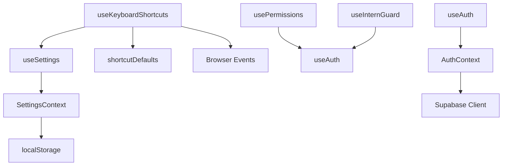

# Custom Hooks Reference

## Custom React Hooks Architecture

Complete reference for all custom hooks: signatures, implementations, dependencies, and usage patterns.

---

## Hooks Overview

```javascript
// Available custom hooks
import { useAuth } from '../context/AuthContext'
import { useSettings } from '../context/SettingsContext'
import { usePerms } from '../context/PermissionsContext'
import { usePermissions } from '../hooks/usePermissions'
import { useKeyboardShortcuts } from '../hooks/useKeyboardShortcuts'
import { useInternGuard } from '../hooks/useInternGuard'
```

---

## 1. useAuth() Hook

### Location
`src/context/AuthContext.jsx`

### Signature
```javascript
function useAuth() → AuthContextValue
```

### Return Value
```javascript
{
  user: Supabase user object | null,
  role: string | null,           // 'admin', 'manager', 'employee', 'intern'
  loading: boolean,              // Auth check in progress
  showLivePopup: boolean,        // Show "We're Live!" popup
  sessionKicked: boolean,        // User kicked out from another device
  setShowLivePopup: () => void   // Function to close popup
}
```

### Usage Example
```javascript
import { useAuth } from '../context/AuthContext'

function MyComponent() {
  const { user, role, loading } = useAuth()
  
  if (loading) return <div>Loading auth...</div>
  if (!user) return <div>Not authenticated</div>
  
  return <div>Welcome {user.email}, your role is {role}</div>
}
```

### Use Cases
- Check if user is logged in
- Get current user email
- Get user role for permissions
- Show session kicked message

### Called By
- Nearly every component
- `Dashboard.jsx`
- `AddInvoiceModal.jsx`
- `SessionMonitor.jsx`

### Dependencies
- AuthContext (created in `src/context/AuthContext.jsx`)
- React's `useContext` hook

### Performance Notes
- Accessing context triggers re-render if context value changes
- Use at highest necessary level in component tree

---

## 2. usePermissions() Hook

### Location
`src/hooks/usePermissions.js`

### Signature
```javascript
function usePermissions() → PermissionsValue
```

### Return Value
```javascript
{
  role: string | null,           // User role
  loading: boolean,              // Auth loading
  isAdmin: boolean,              // role === 'admin'
  isManager: boolean,            // role === 'manager'
  isEmployee: boolean,           // role === 'employee'
  isIntern: boolean,             // role === 'intern'
  canSave: boolean,              // admin || manager
  canEdit: boolean,              // admin || manager
  canDelete: boolean,            // admin only
  canExport: boolean,            // admin || manager
  canImport: boolean,            // admin || manager
  canApprove: boolean,           // admin || manager
  canBulkUpload: boolean,        // admin || manager
}
```

### Implementation
```javascript
export function usePermissions() {
  const { role, loading } = useAuth();

  return {
    role,
    loading,
    isAdmin:    role === 'admin',
    isManager:  role === 'manager',
    isEmployee: role === 'employee',
    isIntern:   role === 'intern',
    canSave:      role === 'admin' || role === 'manager',
    canEdit:      role === 'admin' || role === 'manager',
    canDelete:    role === 'admin',
    canExport:    role === 'admin' || role === 'manager',
    canImport:    role === 'admin' || role === 'manager',
    canApprove:   role === 'admin' || role === 'manager',
    canBulkUpload: role === 'admin' || role === 'manager',
  };
}
```

### Usage Example
```javascript
import { usePermissions } from '../hooks/usePermissions'

function DataTable() {
  const { canEdit, canDelete, isAdmin } = usePermissions()
  
  return (
    <table>
      {canEdit && <EditButton />}
      {canDelete && <DeleteButton />}
      {isAdmin && <AdminActionsColumn />}
    </table>
  )
}
```

### Use Cases
- Show/hide buttons based on role
- Disable features for certain roles
- Conditional rendering of admin panels
- Permission guards in modals

### Called By
- `AddInvoiceModal.jsx`
- `InternalTeamDetails.jsx`
- `Dashboard.jsx`
- Any protected component

### Dependencies
- `useAuth()` hook (to get role)

### Performance Notes
- Derives permissions from AuthContext
- No additional network calls
- Recalculates when role changes

---

## 3. useKeyboardShortcuts() Hook

### Location
`src/hooks/useKeyboardShortcuts.js`

### Signature
```javascript
function useKeyboardShortcuts() → void
```

### Return Value
- None (registers event listeners)

### Implementation Overview
```javascript
export function useKeyboardShortcuts() {
  const { settings, shortcuts, shortcutsLoaded } = useSettings();

  const handleKeyDown = useCallback((e) => {
    // Master switch
    if (!settings.shortcutsEnabled) return;
    // Wait for custom shortcuts to load
    if (!shortcutsLoaded) return;
    
    // Don't fire when typing in input
    const tag = document.activeElement?.tagName?.toLowerCase();
    if (tag === "input" || tag === "textarea" || tag === "select") return;
    if (document.activeElement?.isContentEditable) return;
    
    const combo = comboToString(e);
    if (!combo || !combo.startsWith("ctrl")) return;
    
    // Find matching action
    const action = SHORTCUT_ACTIONS.find(
      (a) => shortcuts[a.id] === combo
    );
    if (!action) return;
    
    // Check per-action toggle
    const toggleKey = TOGGLE_KEY_MAP[action.id];
    if (toggleKey && !settings[toggleKey]) return;
    
    // Dispatch custom event
    e.preventDefault();
    e.stopPropagation();
    window.dispatchEvent(new CustomEvent(action.event, { bubbles: true }));
  }, [settings, shortcuts, shortcutsLoaded]);

  useEffect(() => {
    document.addEventListener("keydown", handleKeyDown);
    return () => document.removeEventListener("keydown", handleKeyDown);
  }, [handleKeyDown]);
}
```

### Usage Example
```javascript
import { useKeyboardShortcuts } from '../hooks/useKeyboardShortcuts'

function App() {
  useKeyboardShortcuts()  // Call once to enable shortcuts
  
  useEffect(() => {
    window.addEventListener('verto:shortcut:add-invoice', () => {
      setModals(prev => ({ ...prev, addInvoice: true }))
    })
  }, [])
  
  return <MainApp />
}
```

### Features
1. **Master switch**: Enable/disable all shortcuts via settings
2. **Input protection**: Don't fire shortcuts while typing
3. **Per-action toggle**: Some shortcuts can be individually disabled
4. **Custom key combos**: User can customize each shortcut
5. **Wait for load**: Waits for user shortcuts to load from DB

### Available Shortcuts

#### Quick Add Group
- `addInvoice` - `ctrl+i` - "Add Invoice"
- `paymentReceived` - `ctrl+p` - "Payment Received"
- `osPayout` - `ctrl+o` - "OS / 3rd Party Payout"
- `salaryPayment` - `ctrl+s` - "Salary Payout"
- `expense` - `ctrl+e` - "Add Expense"
- `creditNote` - `ctrl+c` - "Credit Note / Bad Debt"
- `bounceBack` - `ctrl+b` - "Bounce Back"
- `advanceLoan` - `ctrl+a` - "Advance / Loan"
- `statutory` - `ctrl+g` - "Statutory Payout"

#### Navigate Group
- `dashboardNav` - `ctrl+d` - "Dashboard"
- `internalTeamNav` - `ctrl+t` - "Internal Team"
- `ledgerNav` - `ctrl+l` - "Ledger View"
- `bankNav` - `ctrl+j` - "Bank & Fund Flow"
- `paymentRecordsNav` - `ctrl+r` - "Payment Records"
- `salaryRecordsNav` - `ctrl+y` - "Salary Records"
- `clientAdvanceNav` - `ctrl+m` - "Client Advance"
- `financeRegisterNav` - `ctrl+shift+f` - "Finance Register"

#### Power Group
- `commandPalette` - `ctrl+k` - "Command Palette"
- `globalSearch` - `ctrl+f` - "Global Search"
- `help` - `ctrl+/` - "Show All Shortcuts"

### Called By
- `App.jsx` (called once to setup)
- CommandPalette registers listeners

### Dependencies
- `useSettings()` to get shortcuts and settings
- `shortcutDefaults.js` for SHORTCUT_ACTIONS
- Browser keyboard events

### Performance Notes
- Uses `useCallback` to memoize handler
- Listener added/removed on mount/unmount
- Safe from memory leaks due to cleanup

---

## 4. useInternGuard() Hook

### Location
`src/hooks/useInternGuard.js`

### Signature
```javascript
function useInternGuard() → InternGuardValue
```

### Return Value
```javascript
{
  isIntern: boolean,
  canViewFeature: boolean,       // Can intern access this?
  allowedComponents: Set<string>  // Set of allowed component names
}
```

### Implementation Pattern
```javascript
export function useInternGuard() {
  const { role } = useAuth();
  const isIntern = role === 'intern';
  
  const restrictedFeatures = new Set([
    'delete',
    'bulkUpload',
    'editRole',
    'viewAuditLog',
    'modifySettings'
  ]);
  
  return {
    isIntern,
    canViewFeature: !isIntern,
    allowedComponents: isIntern 
      ? new Set(['Dashboard', 'ViewOnly']) 
      : new Set(['all'])
  };
}
```

### Usage Example
```javascript
import { useInternGuard } from '../hooks/useInternGuard'

function DeleteButton() {
  const { isIntern } = useInternGuard()
  
  if (isIntern) {
    return <button disabled>Can't Delete (Intern Mode)</button>
  }
  
  return <button onClick={handleDelete}>Delete</button>
}
```

### Features
- Hide/disable features for interns
- Show "Intern Mode" banner
- Restrict feature access

### Called By
- Components with restricted features
- `InternModeBanner.jsx`
- Modal components

### Dependencies
- `useAuth()` to get role

---

## Hook Dependencies Graph



---

## Hook Return Value Combinations

### Auth Flow
```javascript
// Not logged in
{ user: null, role: null, loading: false }

// Loading auth
{ user: null, role: null, loading: true }

// Logged in as manager
{ user: {...}, role: 'manager', loading: false }
```

### Permissions Flow
```javascript
// Manager logging in
usePermissions() returns:
{
  role: 'manager',
  isManager: true,
  canSave: true,
  canDelete: false,
  canExport: true
}
```

---

## Custom Hook Best Practices

### ✅ Correct Patterns

```javascript
// Call hook at top level
function Component() {
  const auth = useAuth()  // Top level
  
  return <div>{auth.user?.email}</div>
}

// Use in conditional rendering
function Component() {
  const { canDelete } = usePermissions()
  return canDelete && <DeleteButton />
}

// Chain hooks safely
function Component() {
  const auth = useAuth()
  const perms = usePermissions()  // Both valid
  
  return <div>{auth.user?.email} - {perms.role}</div>
}
```

### ❌ Wrong Patterns

```javascript
// Don't call in loops
function Component() {
  const items = [1, 2, 3]
  return items.map(() => {
    const auth = useAuth()  // ❌ Wrong!
  })
}

// Don't call conditionally
function Component() {
  if (condition) {
    const auth = useAuth()  // ❌ Wrong!
  }
}

// Don't call in event handlers
function Component() {
  const handleClick = () => {
    const auth = useAuth()  // ❌ Wrong!
  }
}
```

---

## Hook Testing

### Test usePermissions
```javascript
test('usePermissions returns correct flags for manager', () => {
  const mockAuth = { role: 'manager', loading: false }
  
  // Mock useAuth to return manager role
  jest.spyOn(AuthContext, 'useAuth').mockReturnValue(mockAuth)
  
  const { result } = renderHook(() => usePermissions())
  
  expect(result.current.isManager).toBe(true)
  expect(result.current.canDelete).toBe(false)
  expect(result.current.canExport).toBe(true)
})
```

### Test useKeyboardShortcuts
```javascript
test('shortcut fires custom event', () => {
  const listener = jest.fn()
  window.addEventListener('verto:shortcut:add-invoice', listener)
  
  // Simulate Ctrl+I
  const event = new KeyboardEvent('keydown', { key: 'i', ctrlKey: true })
  document.dispatchEvent(event)
  
  expect(listener).toHaveBeenCalled()
})
```

---

## Performance Considerations

### Hook Memoization
- `useAuth()` - Cheap, minimal state
- `usePermissions()` - Cheap, derived from auth
- `useKeyboardShortcuts()` - Handler memoized with useCallback
- `useInternGuard()` - Cheap, single check

### Re-render Frequency
- **useAuth()** - Re-renders on auth state change (login/logout)
- **usePermissions()** - Re-renders when role changes
- **useKeyboardShortcuts()** - No re-renders (just listeners)
- **useInternGuard()** - Re-renders when role changes

### Best Practices
1. Call hooks at component top level
2. Use multiple hooks together safely
3. Hooks don't cause circular dependencies
4. Memoize expensive computations above hook calls

---

## Next Steps

1. **Review utilities**: [UTILITIES.md](UTILITIES.md)
2. **Check database tables**: [TABLE_USAGE_MAPPING.md](TABLE_USAGE_MAPPING.md)
3. **Review dependencies**: [DEPENDENCIES.md](DEPENDENCIES.md)
