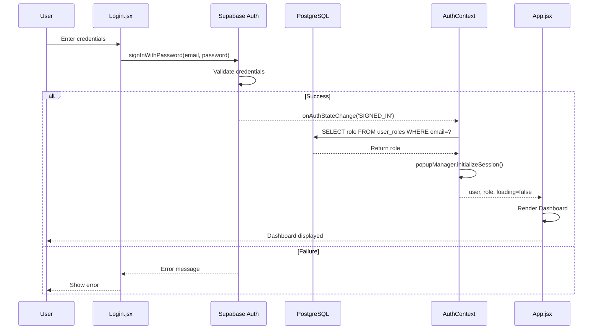
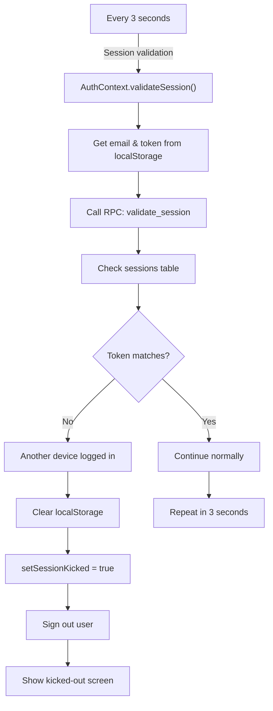
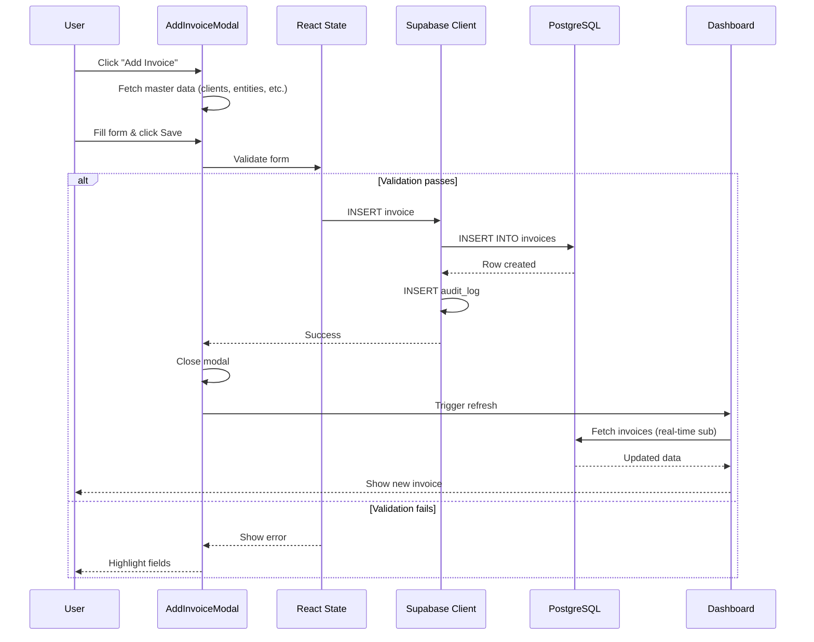
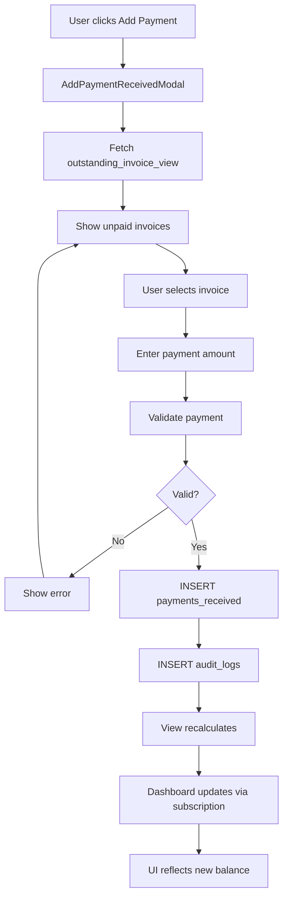
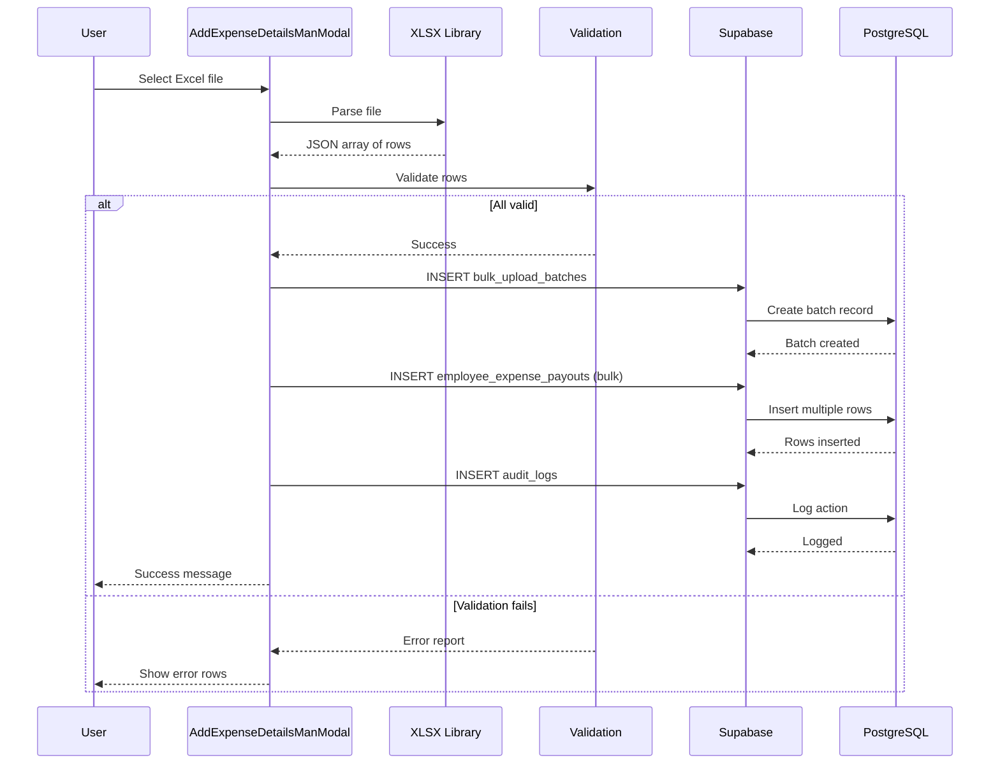
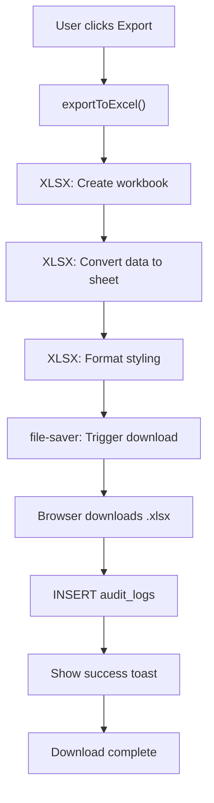
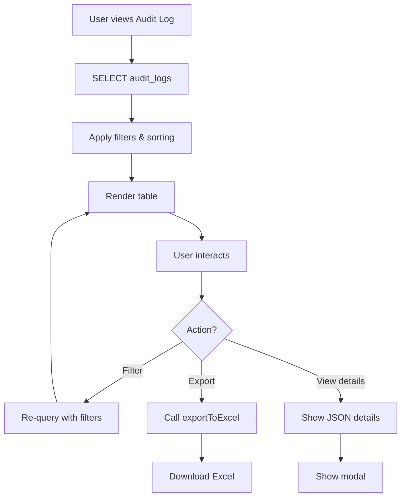
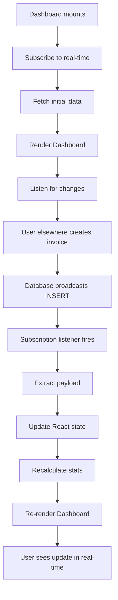

# System Flow & Execution Paths

## End-to-End Execution Flows

Detailed execution chains for critical user actions, from UI interaction to database response.

---

## Flow Diagram Legend

```
User Action
    ↓
Component (React render)
    ↓
Hook (Logic)
    ↓
Context (State management)
    ↓
Supabase Client (API call)
    ↓
Database (PostgreSQL table/view/RPC)
    ↓
Response
    ↓
UI Update (Component re-render)
```

---

## 1. Login Flow

### Execution Chain

```
User enters credentials in Login.jsx
    ↓
handleLogin() called
    ↓
supabase.auth.signInWithPassword()
    ↓
Supabase Auth Service
    ↓
If success: AuthContext notified via auth state listener
    ↓
useAuth() hook updates state: user, role, loading
    ↓
fetchRole(email) → Query user_roles table
    ↓
popupManager.initializeSession() → Create session ID
    ↓
App.jsx receives user context
    ↓
PermissionsContext derives permissions from role
    ↓
Redirect to Dashboard
    ↓
UI renders with user data
```

### Mermaid Sequence Diagram



### Key Tables & Functions

| Database Element | Operation | Purpose |
|-----------------|-----------|---------|
| `auth.users` | SELECT | Validate credentials |
| `user_roles` | SELECT | Fetch user role |
| RPC: `validate_session` | Call | Check session validity |

### Session Polling Start

After login, `startSessionPolling()` begins:
- Every 3 seconds: `validateSession()` calls RPC
- RPC compares stored token with current browser token
- If mismatch: Kick user out (another device logged in)

---

## 2. Session Validation Flow

### Execution Chain

```
Every 3 seconds (after login):
    ↓
validateSession() in AuthContext.jsx
    ↓
Get email & token from localStorage
    ↓
Call RPC: validate_session(p_email, p_token)
    ↓
RPC queries sessions table:
    - Find latest session for this email
    - Compare stored token with p_token
    - Return {valid: true/false}
    ↓
If invalid:
    - Clear localStorage
    - setSessionKicked(true)
    - Sign out user
    - Show "You've been signed out" screen
    ↓
If valid:
    - Continue normally
```

### Mermaid Diagram



### Performance Note

⚠️ **Performance-Sensitive Area**: RPC called every 3 seconds per active user

---

## 3. Invoice Creation Flow

### Execution Chain

```
User clicks "Add Invoice" button or presses Ctrl+I
    ↓
CommandPalette / Keyboard Shortcut Handler
    ↓
AddInvoiceModal opens (modal state)
    ↓
Component mounts:
    - Fetch clients_master
    - Fetch entities_master
    - Fetch departments_master
    - Fetch bank_master
    ↓
User fills form:
    - Entity selection
    - Client (search/create)
    - Invoice amount, date
    - Description, tags
    ↓
User clicks "Save"
    ↓
Client-side validation:
    - Required fields check
    - Amount > 0
    - Date validity
    ↓
If validation passes:
    ↓
INSERT into invoices table:
    - invoice_number (auto-generated)
    - entity_id
    - client_name
    - invoice_value
    - invoice_date
    - created_by (from useAuth)
    - created_at (server timestamp)
    ↓
INSERT into audit_logs:
    - action: "INSERT"
    - category: "INVOICE"
    - description: details
    - new_values: invoice data
    - actor_email: current user
    ↓
If success:
    - Show success toast
    - Modal closes
    - Refresh Dashboard data
    - Call parent onSuccess callback
    ↓
If error:
    - Show error toast
    - Keep modal open
    - Preserve form data
    ↓
Dashboard updates automatically (real-time subscription)
```

### Mermaid Sequence Diagram



### Tables Involved

| Table | Operation | Purpose |
|-------|-----------|---------|
| `invoices` | INSERT | Store invoice data |
| `audit_logs` | INSERT | Log the action |
| `entities_master` | SELECT | Fetch entity list |
| `clients_master` | SELECT | Fetch client list |
| `departments_master` | SELECT | Fetch department list |

### Key Code Locations

- **Modal**: `src/components/AddInvoiceModal.jsx`
- **Keyboard handler**: `src/hooks/useKeyboardShortcuts.js`
- **Audit logging**: `src/utils/Auditlog.js`
- **Permissions check**: Uses `usePerms()` hook

---

## 4. Payment Received Flow

### Execution Chain

```
User navigates to Dashboard
    ↓
Sees "Outstanding Invoices" section
    ↓
User clicks "Add Payment" button or presses Ctrl+P
    ↓
AddPaymentReceivedModal opens
    ↓
Component mounts:
    - Fetch outstanding_invoice_view
    - Show invoices with outstanding balance
    ↓
User selects invoice & enters payment amount
    ↓
System calculates:
    - Paid amount
    - Outstanding balance = invoice_value - total_paid
    ↓
User submits
    ↓
Client validation:
    - Payment ≤ outstanding balance
    - Amount > 0
    - Date validity
    ↓
INSERT into payments_received:
    - invoice_id (FK)
    - payment_date
    - payment_amount
    - reference_number (bank ref, cheque #, etc.)
    - payment_method (cash, cheque, transfer, etc.)
    - created_by (user)
    ↓
May also INSERT advance_payments (if paying for future invoices)
    ↓
INSERT into audit_logs (log the payment)
    ↓
outstanding_invoice_view auto-updates:
    - Recalculates outstanding = invoice_value - SUM(payments)
    ↓
Dashboard real-time subscription notified
    ↓
UI updates:
    - Invoice marked as "Paid" if outstanding = 0
    - Stats updated
    - Charts refreshed
```

### Mermaid Diagram



### Key Tables

| Table | Operation | Purpose |
|-------|-----------|---------|
| `payments_received` | INSERT | Record payment |
| `invoices` | SELECT | Fetch invoice data |
| `outstanding_invoice_view` | SELECT | Show unpaid invoices |
| `audit_logs` | INSERT | Log transaction |
| `advance_payments` | INSERT (optional) | Record advance |

---

## 5. Employee Bulk Upload Flow

### Execution Chain

```
User navigates to Dashboard
    ↓
User clicks "Add Expense / Man" or presses Ctrl+E
    ↓
AddExpenseDetailsManModal opens
    ↓
User selects Excel file (XLSX format)
    ↓
Client-side Excel parsing:
    - Read file using XLSX library
    - Parse sheet into JSON rows
    - Expected columns: Emp Code, Name, Entity, Department, Amount, Month
    ↓
Data validation:
    - All rows have required fields
    - Amount is numeric
    - Entity exists in entities_master
    - Department exists in departments_master
    ↓
If errors:
    - Show error rows
    - Ask user to fix
    - Abort upload
    ↓
If valid:
    ↓
INSERT into bulk_upload_batches:
    - batch_id (UUID)
    - created_by (user)
    - file_name
    - row_count
    - status: "pending"
    - created_at
    ↓
FOR EACH row in Excel:
    INSERT into employee_expense_payouts:
    - batch_id (FK)
    - emp_code
    - emp_name
    - entity_id
    - department_id
    - expense_amount
    - month
    - created_by
    - created_at
    ↓
INSERT into audit_logs:
    - action: "BULK_UPLOAD"
    - category: "PAYROLL"
    - row_count
    - file_name
    ↓
UPDATE bulk_upload_batches:
    - status: "completed"
    ↓
Show success message with row count
    ↓
User can view in ExpenseRecordsView
    ↓
Data visible in salary reports
```

### Mermaid Sequence Diagram



### Key Tables

| Table | Operation | Purpose |
|-------|-----------|---------|
| `bulk_upload_batches` | INSERT | Track bulk upload |
| `employee_expense_payouts` | INSERT (bulk) | Store expense data |
| `audit_logs` | INSERT | Log bulk action |
| `entities_master` | SELECT | Validate entity |
| `departments_master` | SELECT | Validate department |

### Key Libraries

- **XLSX**: `xlsx` package for parsing Excel
- **Validation**: Client-side validation in Modal component

---

## 6. Export Excel Flow

### Execution Chain

```
User views Dashboard / Report
    ↓
User clicks "Download Excel" or "Export" button
    ↓
exportToExcel() function called:
    - Receives data array
    - Receives filename
    - Receives sheet name (optional)
    ↓
XLSX library processes:
    - Creates workbook
    - Converts JSON to worksheet
    - Sets column widths (optional)
    - Sets styles (optional)
    ↓
Generates Excel file in memory
    ↓
file-saver library triggers download:
    - Browser downloads .xlsx file
    - File saved to user's Downloads folder
    ↓
INSERT into audit_logs:
    - action: "EXPORT_EXCEL"
    - category: depends on data type
    - description: filename, row count
    - reference_no: invoice ID (if specific)
    - client_name: if invoice export
    - amount: if financial data
    - actor_email: current user
    ↓
Show success toast
```

### Mermaid Diagram



### Key Libraries & Files

| Library | Purpose | File |
|---------|---------|------|
| `xlsx` | Parse & create Excel | `src/utils/exportExcel.js` |
| `file-saver` | Trigger browser download | Browser native API |
| `logExport()` | Log export action | `src/utils/Auditlog.js` |

### Tables Involved

| Table | Operation | Purpose |
|-------|-----------|---------|
| `audit_logs` | INSERT | Record export |

---

## 7. Audit Log View Flow

### Execution Chain

```
User navigates to Admin > Audit Log
    ↓
Auditlogpage component mounts
    ↓
Fetch audit_logs table:
    - ORDER BY created_at DESC
    - LIMIT 1000 (or paginated)
    - Optional filters: actor_email, action, category, date_range
    ↓
Display in table:
    - Actor email
    - Action (INSERT, UPDATE, DELETE, EXPORT)
    - Category (INVOICE, PAYMENT, PAYROLL, etc.)
    - Description
    - Reference number (invoice ID, etc.)
    - Timestamp
    - Client name (if applicable)
    - Amount (if applicable)
    - Old values vs new values (JSON)
    ↓
User can:
    - Filter by actor, action, category
    - Sort by date, amount
    - Search description
    - Export to Excel
    ↓
Row-level security enforces:
    - Only admins can view audit logs
    - Admins can see all logs
    - Managers can see user-level logs
    ↓
Real-time: New audit entries appear as they're logged
```

### Mermaid Diagram



### Key Components & Tables

| File | Purpose | Table |
|------|---------|-------|
| `src/components/Auditlogpage.jsx` | Display audit logs | `audit_logs` |
| `src/utils/Auditlog.js` | Log actions | `audit_logs` (INSERT) |

---

## 8. Real-Time Dashboard Update Flow

### Execution Chain

```
User lands on Dashboard
    ↓
Dashboard component mounts
    ↓
Subscribe to real-time changes:
    - supabase.from('invoices').on('*')
    - supabase.from('payments_received').on('*')
    - supabase.from('payment_made_manual').on('*')
    ↓
Fetch initial data:
    - SELECT * FROM invoices
    - SELECT * FROM outstanding_invoice_view
    - SELECT * FROM payments_received
    ↓
Render Dashboard with data
    ↓
Another user (different session) creates invoice
    ↓
Database triggers broadcast:
    - INSERT event on invoices table
    - Subscription listener receives payload
    ↓
Dashboard component receives event:
    ```javascript
    payload.eventType = 'INSERT'
    payload.new = {new invoice data}
    payload.old = null
    payload.table = 'invoices'
    ```
    ↓
Component updates state:
    - ADD new invoice to state array
    - Recalculate stats (total invoices, total value)
    - Update charts
    ↓
React re-renders Dashboard
    ↓
User sees new invoice in real-time
    ↓
Outstanding invoice view also updates automatically
```

### Mermaid Diagram



### Key Code

**Subscribe to real-time**:
```javascript
supabase
  .from('invoices')
  .on('*', (payload) => {
    // Handle INSERT, UPDATE, DELETE
    handleInvoiceChange(payload)
  })
  .subscribe()
```

### Performance Notes

⚠️ **Potential Performance Issue**: Multiple subscribers on same table could cause re-renders

---

## Summary of All Flows

| Flow | User Action | Primary Table | Duration | Key Dependency |
|------|-------------|---|----------|---|
| Login | Submit credentials | auth.users, user_roles | ~2s | Supabase Auth |
| Session Validation | (auto, every 3s) | sessions | <100ms | RPC function |
| Invoice Creation | Click "Add Invoice" | invoices, audit_logs | ~1s | usePerms |
| Payment Received | Click "Record Payment" | payments_received, audit_logs | ~1s | outstanding_invoice_view |
| Bulk Upload | Upload Excel file | employee_expense_payouts, audit_logs | ~5-30s | XLSX parser |
| Export Excel | Click "Export" | audit_logs | ~2s | file-saver |
| Audit Log View | Navigate to Admin | audit_logs | ~500ms | RLS policies |
| Real-time Update | (auto on subscription) | All tables | <100ms | Supabase subscription |

---

## Critical Paths & Bottlenecks

### High-Impact Operations
1. **Bulk Excel Upload** - Processes 100s of rows, network heavy
2. **Dashboard Real-time Subscription** - Multiple simultaneous subscribers
3. **Audit Logging** - Every transaction generates log entry

### Performance Optimizations Applied
1. **Chunking**: Vite splits bundle into multiple chunks
2. **Lazy Loading**: Page components load on-demand
3. **Memoization**: Components use React.memo for heavy rendering

### Circular Dependencies: NONE FOUND ✓

---

## Next Steps

1. **Understand component tree**: Read [COMPONENT_TREE.md](COMPONENT_TREE.md)
2. **Learn context state**: Read [CONTEXTS.md](CONTEXTS.md)
3. **Check database tables**: Read [TABLE_USAGE_MAPPING.md](TABLE_USAGE_MAPPING.md)
