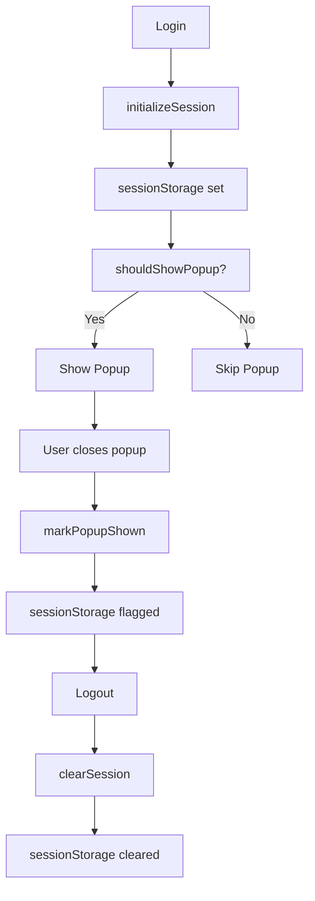
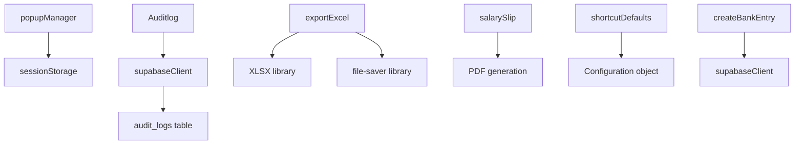

# Utility Functions Reference

## Shared Utility Functions & Helpers

Complete reference for all utility modules: functions, parameters, return values, side effects, and usage patterns.

---

## Utility Modules Overview

```
src/utils/
├── popupManager.js              # Session popup management
├── Auditlog.js                  # Audit logging
├── exportExcel.js               # Excel export functionality
├── Invoiceexport.js             # Invoice-specific export
├── salarySlip.js                # Salary slip generation
├── shortcutDefaults.js          # Keyboard shortcuts definitions
├── createBankEntry.js           # Bank entry creation
└── lib/utils.js                 # General utilities
```

---

## 1. popupManager

### Location
`src/utils/popupManager.js`

### Purpose
Manage "We're Live!" popup display - show only once per login session.

### Functions

#### `initializeSession(userId)`
**Purpose**: Initialize a new session when user logs in

**Parameters**:
- `userId` (string) - Supabase user ID

**Returns**: string - Generated session ID in format `${userId}_${Date.now()}`

**Side Effects**:
- Sets `verto_session_id` in sessionStorage
- Returns for tracking purposes

**Example**:
```javascript
const sessionId = popupManager.initializeSession('user-123')
// sessionStorage.verto_session_id = 'user-123_1718555000000'
```

#### `shouldShowPopup()`
**Purpose**: Check if popup should be displayed

**Parameters**: None

**Returns**: boolean - true if popup hasn't been shown in this session

**Logic**:
```javascript
sessionId exists && popupShown not set = true
Otherwise = false
```

**Side Effects**: None (read-only)

**Example**:
```javascript
if (popupManager.shouldShowPopup()) {
  setShowLivePopup(true)
}
```

#### `markPopupShown()`
**Purpose**: Mark popup as shown in this session

**Parameters**: None

**Returns**: void

**Side Effects**:
- Sets `verto_live_popup_shown` to 'true' in sessionStorage
- Prevents popup from showing again until logout

**Example**:
```javascript
popupManager.markPopupShown()
```

#### `clearSession()`
**Purpose**: Clear session data on logout

**Parameters**: None

**Returns**: void

**Side Effects**:
- Removes `verto_session_id` from sessionStorage
- Removes `verto_live_popup_shown` from sessionStorage
- Resets session state

**Example**:
```javascript
popupManager.clearSession()
```

### Storage Keys
- `verto_session_id` - Current session identifier
- `verto_live_popup_shown` - Popup display flag

### Used By
- `AuthContext.jsx` - Initialize on login
- `App.jsx` - Check if should show popup
- `LivePopup.jsx` - On close handler

### State Diagram



---

## 2. Auditlog

### Location
`src/utils/Auditlog.js`

### Purpose
Log all data modifications for compliance and audit trail.

### Constants

#### `EXPORT_ACTIONS`
```javascript
{
  EXCEL:       "EXPORT_EXCEL",
  PDF:         "EXPORT_PDF",
  ZIP:         "EXPORT_ZIP",
  SALARY_SLIP: "EXPORT_SALARY_SLIP",
  TEMPLATE:    "EXPORT_TEMPLATE",
}
```

### Functions

#### `getActorEmail()`
**Purpose**: Get current user email from localStorage

**Parameters**: None

**Returns**: string - User email or "unknown"

**Implementation**: `localStorage.getItem("verto_user_email")`

**Side Effects**: None

#### `logExport(options)`
**Purpose**: Log an export action

**Parameters**:
```javascript
{
  action: string,              // EXPORT_EXCEL, EXPORT_PDF, etc.
  category: string,            // INVOICE, PAYMENT, PAYROLL, etc.
  description: string,         // Human-readable description
  reference_no?: string,       // Invoice ID, transaction ID
  client_name?: string,        // Client name if applicable
  amount?: number,             // Amount if financial data
  meta?: object                // Additional metadata (JSON)
}
```

**Returns**: Promise (INSERT result)

**Database Operation**:
```sql
INSERT INTO audit_logs (
  action,
  category,
  actor_email,
  description,
  reference_no,
  client_name,
  amount,
  new_values,
  old_values
) VALUES (...)
```

**Side Effects**:
- Inserts record into audit_logs table
- Never blocks the UI (wrapped in try-catch)

**Example**:
```javascript
await logExport({
  action: 'EXPORT_EXCEL',
  category: 'INVOICE',
  description: 'Exported invoices for month of June',
  reference_no: 'INV-2024-001',
  client_name: 'ABC Corp',
  amount: 50000,
  meta: { rows: 100, filters: { dateRange: '2024-06-01 to 2024-06-30' } }
})
```

### Used By
- `Dashboard.jsx` - Log exports
- `Analyticsdashboard.jsx` - Log report exports
- `InternalTeamDetails.jsx` - Log employee export
- All export buttons

### Audit Log Queries
Query the audit log to see what users did:

```sql
-- View recent exports
SELECT * FROM audit_logs 
WHERE action = 'EXPORT_EXCEL' 
ORDER BY created_at DESC 
LIMIT 100;

-- View all actions by user
SELECT * FROM audit_logs 
WHERE actor_email = 'user@example.com' 
ORDER BY created_at DESC;

-- View actions on specific invoice
SELECT * FROM audit_logs 
WHERE reference_no = 'INV-2024-001' 
ORDER BY created_at DESC;
```

---

## 3. exportExcel

### Location
`src/utils/exportExcel.js`

### Purpose
Export data to Excel (.xlsx) format using XLSX library.

### Functions

#### `exportToExcel(data, filename, sheetName)`
**Purpose**: Generate and download Excel file

**Parameters**:
- `data` (array) - Array of objects to export
- `filename` (string) - Name for downloaded file (without extension)
- `sheetName` (string, optional) - Sheet tab name (default: 'Sheet1')

**Returns**: void

**Implementation**:
```javascript
export function exportToExcel(data, filename, sheetName = 'Sheet1') {
  const workbook = XLSX.utils.book_new()
  const worksheet = XLSX.utils.json_to_sheet(data)
  XLSX.utils.book_append_sheet(workbook, worksheet, sheetName)
  XLSX.writeFile(workbook, `${filename}.xlsx`)
}
```

**Dependencies**: XLSX library, file-saver

**Side Effects**:
- Triggers browser download
- Creates temporary blob
- Automatically names file

**Example**:
```javascript
const invoices = [
  { id: 1, amount: 50000, date: '2024-06-01' },
  { id: 2, amount: 75000, date: '2024-06-02' }
]

exportToExcel(invoices, 'invoices_june_2024', 'Invoices')

// Downloads as: invoices_june_2024.xlsx
```

### Used By
- `Dashboard.jsx`
- `Analyticsdashboard.jsx`
- `InternalTeamDetails.jsx`
- `ProfitCenterPL.jsx`
- All export features

### Browser Compatibility
✅ Works in all modern browsers
- Chrome, Firefox, Safari, Edge
- Not supported in very old IE versions

---

## 4. Invoiceexport

### Location
`src/utils/Invoiceexport.js`

### Purpose
Invoice-specific export functionality with custom formatting.

### Use Case
Export invoices with special formatting, filters, and totals.

### Implementation Pattern
```javascript
// Prepare invoice data
const invoices = await fetchInvoices()

// Format for Excel
const formatted = formatInvoicesForExport(invoices)

// Add totals row
formatted.push({ total: sumAll(formatted) })

// Export
exportToExcel(formatted, 'invoices', 'Invoice Report')
```

---

## 5. salarySlip

### Location
`src/utils/salarySlip.js`

### Purpose
Generate salary slip PDFs for employees.

### Implementation Pattern
- Fetch employee data
- Calculate salary components
- Format as PDF
- Download or print

### Use Case
HR can generate and download individual salary slips.

---

## 6. shortcutDefaults

### Location
`src/utils/shortcutDefaults.js`

### Purpose
Central registry of keyboard shortcuts and actions.

### Constants

#### `SHORTCUT_ACTIONS`
Array of all available shortcuts with metadata:

```javascript
[
  {
    id: "addInvoice",           // Unique ID
    label: "Add Invoice",       // Display name
    group: "Quick Add",         // Category
    default: "ctrl+i",          // Default key combo
    event: "verto:shortcut:add-invoice"  // Custom event
  },
  // ... more shortcuts
]
```

#### `SHORTCUT_ACTIONS_BY_ID`
```javascript
{
  addInvoice: { id, label, group, default, event },
  paymentReceived: { ... },
  // ... etc
}
```

#### `DEFAULT_SHORTCUT_MAP`
```javascript
{
  addInvoice: "ctrl+i",
  paymentReceived: "ctrl+p",
  // ... etc
}
```

### Functions

#### `comboToString(keyboardEvent)`
**Purpose**: Convert KeyboardEvent to normalized combo string

**Parameters**:
- `keyboardEvent` (KeyboardEvent) - Browser keyboard event

**Returns**: string - Normalized combo like "ctrl+i" or null if only modifiers

**Format**: 
- Lowercase
- Modifiers in order: ctrl, shift, alt
- Format: "ctrl+i", "ctrl+shift+f"

**Example**:
```javascript
document.addEventListener('keydown', (e) => {
  const combo = comboToString(e)
  console.log(combo)  // "ctrl+i"
})
```

#### `findConflict(shortcuts, combo, excludeId)`
**Purpose**: Detect duplicate keyboard shortcuts

**Parameters**:
- `shortcuts` (object) - Current shortcut mappings
- `combo` (string) - Combo to check
- `excludeId` (string, optional) - ID to skip in comparison

**Returns**: string | null - ID of conflicting shortcut, or null

**Example**:
```javascript
const conflict = findConflict(shortcuts, 'ctrl+i', 'addInvoice')
if (conflict) {
  showError(`Already assigned to ${conflict}`)
}
```

### Available Shortcuts

#### Quick Add Group (9 shortcuts)
- `ctrl+i` - Add Invoice
- `ctrl+p` - Payment Received
- `ctrl+o` - OS Payout
- `ctrl+s` - Salary Payment
- `ctrl+e` - Add Expense
- `ctrl+c` - Credit Note / Bad Debt
- `ctrl+b` - Bounce Back
- `ctrl+a` - Advance / Loan
- `ctrl+g` - Statutory Payout

#### Navigate Group (8 shortcuts)
- `ctrl+d` - Dashboard
- `ctrl+t` - Internal Team
- `ctrl+l` - Ledger View
- `ctrl+j` - Bank & Fund Flow
- `ctrl+r` - Payment Records
- `ctrl+y` - Salary Records
- `ctrl+m` - Client Advance
- `ctrl+shift+f` - Finance Register

#### Power Group (3 shortcuts)
- `ctrl+k` - Command Palette
- `ctrl+f` - Global Search
- `ctrl+/` - Show All Shortcuts

### Used By
- `useKeyboardShortcuts.js` - Hook reads shortcuts
- `Settingspage.jsx` - Settings UI displays shortcuts
- `ShortcutsHelp.jsx` - Help panel shows shortcuts
- `CommandPalette.jsx` - Palette uses these

---

## 7. createBankEntry

### Location
`src/utils/createBankEntry.js`

### Purpose
Create bank reconciliation entries.

### Implementation Pattern
- Fetch unmatched payments
- Match with invoices
- Create bank entry record
- Link to payment

---

## 8. lib/utils.js

### Location
`src/lib/utils.js`

### Purpose
General utility functions (validation, formatting, helpers)

### Common Patterns
- Input validation
- Number formatting
- Date formatting
- String utilities

### Example Functions
```javascript
// Validation
isValidEmail(email)
isValidAmount(amount)
isValidDate(date)

// Formatting
formatCurrency(amount, currency)
formatDate(date, format)
formatPhoneNumber(phone)

// Helpers
debounce(fn, delay)
throttle(fn, delay)
capitalize(str)
```

---

## Utility Dependencies Graph



---

## Usage Patterns

### Exporting Data
```javascript
import { exportToExcel } from '../utils/exportExcel'
import { logExport } from '../utils/Auditlog'

async function handleExport(data, filename) {
  try {
    exportToExcel(data, filename, 'Data')
    
    // Log the export
    await logExport({
      action: 'EXPORT_EXCEL',
      category: 'REPORTS',
      description: `Exported ${filename}`,
      meta: { rows: data.length }
    })
  } catch (error) {
    console.error('Export failed', error)
  }
}
```

### Managing Popups
```javascript
import { popupManager } from '../utils/popupManager'

useEffect(() => {
  if (popupManager.shouldShowPopup()) {
    setShowLivePopup(true)
  }
}, [])

const handleClose = () => {
  popupManager.markPopupShown()
  setShowLivePopup(false)
}
```

### Using Shortcuts
```javascript
import { SHORTCUT_ACTIONS, comboToString } from '../utils/shortcutDefaults'

const handleKeyDown = (e) => {
  const combo = comboToString(e)
  const action = SHORTCUT_ACTIONS.find(a => a.default === combo)
  
  if (action) {
    window.dispatchEvent(new CustomEvent(action.event))
  }
}
```

---

## Error Handling in Utilities

### Safe Error Handling
```javascript
// Auditlog never blocks UI
export async function logExport(options) {
  try {
    await supabase.from("audit_logs").insert([...])
  } catch {
    // Silent fail - never interrupt user
  }
}

// Export never blocks UI
export function exportToExcel(data, filename) {
  try {
    // Generate file
    XLSX.writeFile(workbook, `${filename}.xlsx`)
  } catch (error) {
    console.error('Export failed:', error)
    // User gets browser error, not application crash
  }
}
```

### Validation Patterns
```javascript
// Validate before action
const { data, error } = await supabase.from('table').select()

if (error) {
  throw new Error(`Failed to fetch: ${error.message}`)
}

if (!Array.isArray(data)) {
  throw new Error('Invalid response format')
}
```

---

## Performance Considerations

### Lazy Loading Utilities
- Import only when needed
- Don't import in main.jsx
- Import inside functions/components

### File Size
- XLSX library is largest (~500KB, already bundled)
- Other utils are small (<10KB each)

### Optimization Tips
```javascript
// Good: Import inside function
async function handleExport() {
  const { exportToExcel } = await import('../utils/exportExcel')
  exportToExcel(data, filename)
}

// Less efficient: Import at top
import { exportToExcel } from '../utils/exportExcel'
```

---

## Testing Utilities

### Test Popup Manager
```javascript
test('popup shown only once per session', () => {
  popupManager.initializeSession('user-123')
  expect(popupManager.shouldShowPopup()).toBe(true)
  
  popupManager.markPopupShown()
  expect(popupManager.shouldShowPopup()).toBe(false)
  
  popupManager.clearSession()
  expect(popupManager.shouldShowPopup()).toBe(false)
})
```

### Test Audit Log
```javascript
test('audit log records export action', async () => {
  await logExport({
    action: 'EXPORT_EXCEL',
    category: 'INVOICE'
  })
  
  // Query audit_logs table
  const logs = await supabase
    .from('audit_logs')
    .select('*')
    .eq('action', 'EXPORT_EXCEL')
  
  expect(logs.data.length).toBeGreaterThan(0)
})
```

---

## Next Steps

1. **Check table usage**: [TABLE_USAGE_MAPPING.md](TABLE_USAGE_MAPPING.md)
2. **Review environment variables**: [ENVIRONMENT_VARIABLES.md](ENVIRONMENT_VARIABLES.md)
3. **Check dependencies**: [DEPENDENCIES.md](DEPENDENCIES.md)
